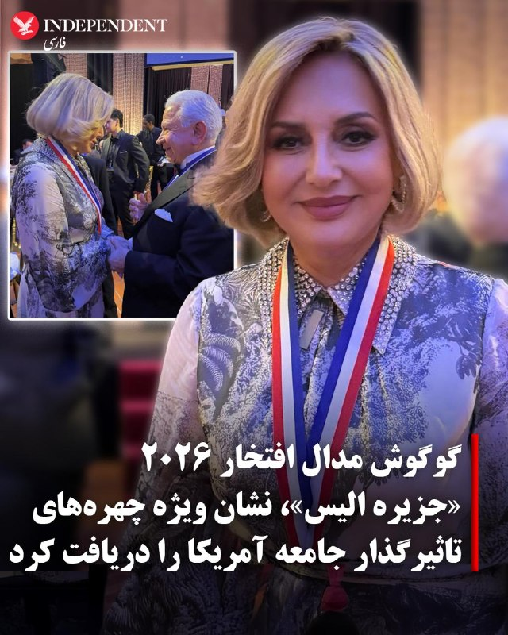
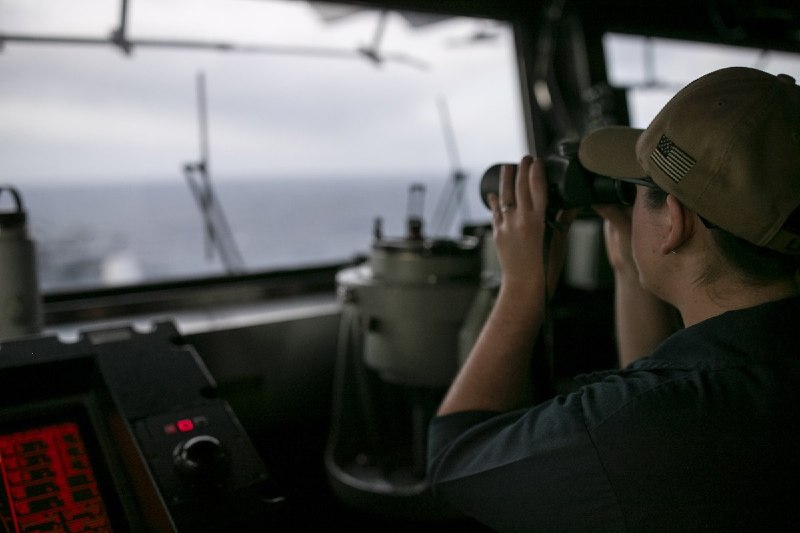
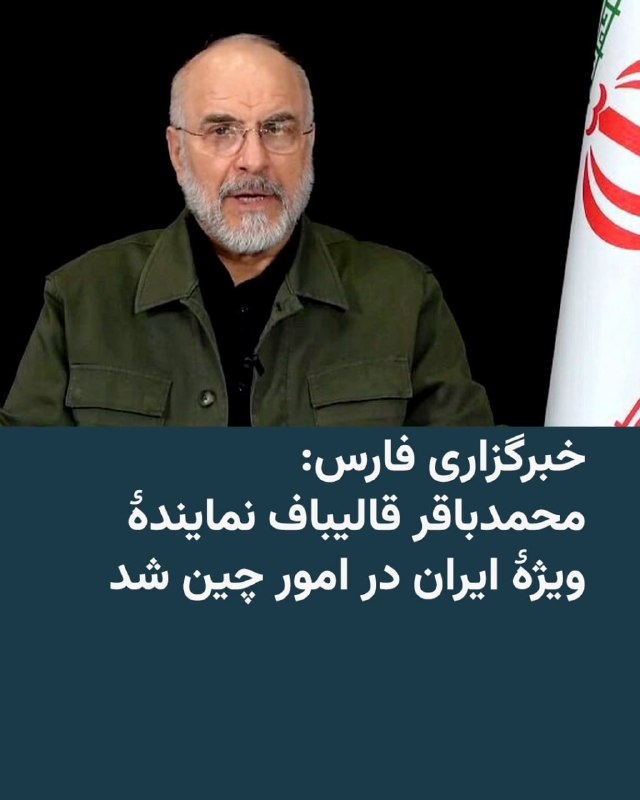
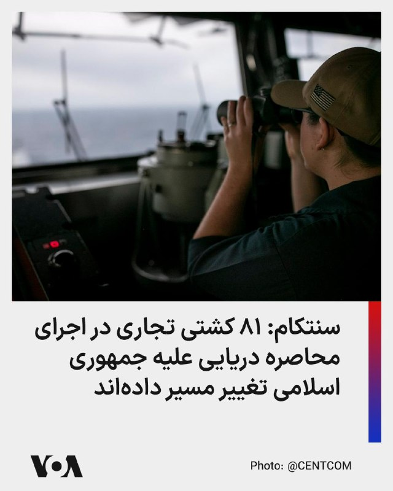
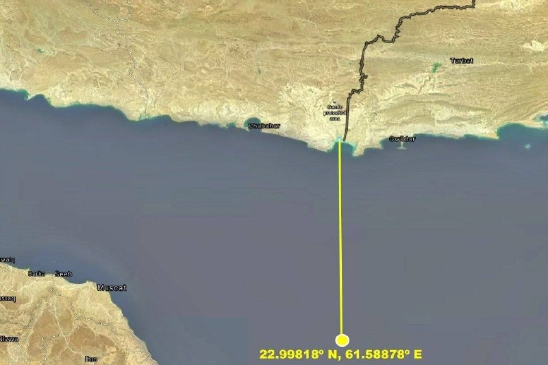
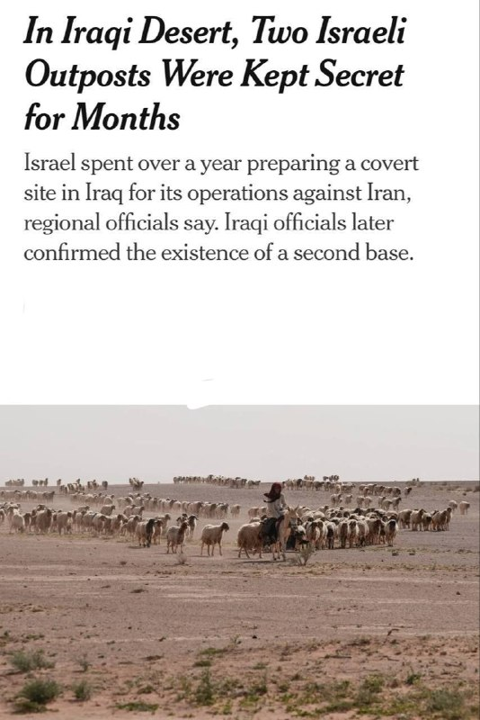
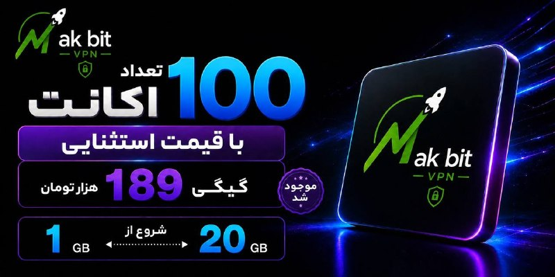
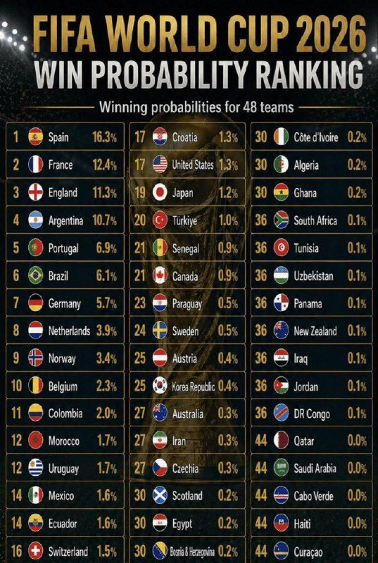

# خواننده تلگرام

<!-- TOP_NAV START -->

<!-- TOP_NAV END -->

<!-- MSG START -->

---
📅 بروزرسانی: 1405/02/27 19:48
---

## VahidOOnLine — post 240655

  <a href="telegram/content/VahidOOnLine_240655_1779034693.mp4" target="_blank">🎬 Download video</a>

♦️صدا و سیمای جمهوری اسلامی تصاویری از برگزاری دوره‌های آموزش کار با اسلحه برای زنان و مردان در مساجد نقاط مختلف کشور پخش کرده است.
در تصاویر منتشرشده از سوی شبکه خبر جمهوری اسلامی ایران، زنان و مردان در محیط‌های مسجدی در حال شرکت در آموزش‌های دفاعی دیده می‌شوند. این گزارش همچنین شامل اظهارنظر برخی شرکت‌کنندگان درباره این برنامه‌ها است.
جزئیات بیشتری درباره محل دقیق برگزاری این آموزش‌ها، تعداد شرکت‌کنندگان یا هدف رسمی این دوره‌ها منتشر نشده است.
روز شنبه تفنگ دست گرفتن مجری‌های تلویزیون در ایران، خبرساز شده بود.
‌🇸🇦 Indypersian

🤖 @VahidOOnLine

## VahidOOnLine — post 240654

  <a href="telegram/content/VahidOOnLine_240654_1779034694.mp4" target="_blank">🎬 Download video</a>

‌
«صدای فاطمه سپهری باشیم» ـ گزارشگر
‌🏁 🇬🇧 ManotoTV

🤖 @VahidOOnLine

## VahidOOnLine — post 240653

  <a href="telegram/content/VahidOOnLine_240653_1779034695.mp4" target="_blank">🎬 Download video</a>

مجارستان؛ گردهمایی ایرانیان _ گزارشگر یکشنبه ۲۷ اردیبهشت
‌🏁 🇬🇧 ManotoTV

🤖 @VahidOOnLine

## VahidOOnLine — post 240652

  <a href="telegram/content/VahidOOnLine_240652_1779034696.mp4" target="_blank">🎬 Download video</a>

‌
وین | اتریش؛ گردهمایی ایرانیان _ گزارشگر یکشنبه ۲۷ اردیبهشت
‌🏁 🇬🇧 ManotoTV

🤖 @VahidOOnLine

## VahidOOnLine — post 240651

  

مسعود پزشکیان در پیامی در شبکه اجتماعی ایکس به مناسبت روز جهانی ارتباطات نوشت: «در روزهای جنگ، فرزندان ما در ارتباطات و فناوری اطلاعات شبانه‌روز ایستادند تا ارتباطات کشور پایدار بماند.»
او همچنین دسترسی باکیفیت و پایدار مردم به خدمات دیجیتال را «بخشی از آرامش، پیشرفت و حق زندگی شایسته مردم» ایران دانست.
‌🏁 🇬🇧 IranintlTV

🤖 @VahidOOnLine

## VahidOOnLine — post 240650

  <a href="telegram/content/VahidOOnLine_240650_1779034698.mp4" target="_blank">🎬 Download video</a>

بازار تهران؛ ۲۷ اردیبهشت ـ گزارشگر
‌🏁 🇬🇧 ManotoTV

🤖 @VahidOOnLine

## VahidOOnLine — post 240649

  <a href="telegram/content/VahidOOnLine_240649_1779034699.mp4" target="_blank">🎬 Download video</a>

‌
پورتو | پرتغال؛ گردهمایی ایرانیان ـ گزارشگر یکشنبه ۲۷ اردیبهشت
‌🏁 🇬🇧 ManotoTV

🤖 @VahidOOnLine

## VahidOOnLine — post 240648

  

♦️گوگوش، خواننده نامدار ایرانی، در پیامی در اینستاگرام اعلام کرد مدال افتخار سال ۲۰۲۶ «جزیره الیس» را دریافت کرده و این جایزه را با «عشق و احترام» به مردم ایران تقدیم می‌کند.

او نوشت: «دیشب افتخار داشتم نشان افتخار جزیره الیس را دریافت کنم؛ نشانی که به افرادی اهدا می‌شود که در جامعه آمریکا تأثیرگذار بوده‌اند و در عین حال ریشه‌ها و هویت فرهنگی خود را حفظ کرده‌اند.»

«نشان افتخار جزیره الیس» یکی از شناخته‌شده‌ترین جوایز مدنی آمریکا است که از سال ۱۹۸۶ به افرادی از حوزه‌های هنر، فرهنگ، سیاست، علم، تجارت و فعالیت‌های اجتماعی اعطا می‌شود؛ افرادی که علاوه بر نقش‌آفرینی در جامعه آمریکا، بر حفظ پیشینه و هویت فرهنگی خود نیز تأکید داشته‌اند. این جایزه در جزیره الیس نیویورک، نماد ورود میلیون‌ها مهاجر به آمریکا، اهدا می‌شود.

از چهره‌های شناخته‌شده‌ای که در سال‌های مختلف این نشان را دریافت کرده‌اند می‌توان به رونالد ریگان، ریچارد نیکسون، رزا پارکس، فرانک سیناترا، گلوریا استفان، ملاله یوسف‌زی و دونالد ترامپ اشاره کرد.
‌🇸🇦 Indypersian

🤖 @VahidOOnLine

## VahidOOnLine — post 240647

  

گوگوش، خواننده سرشناس ایرانی، «نشان افتخار جزیره آلیس» را دریافت کرد؛ «این نشان به افرادی اهدا می‌شود که در جامعه آمریکا تأثیرگذار بوده‌اند و در عین حال ریشه‌ها و هویت فرهنگی خود را حفظ کرده‌اند.»

گوگوش با انتشار تصویری از مراسم اهدای این نشان در صفحه اینستاگرام خود نوشت: «این نشان را با عشق و احترام به مردم ایران تقدیم می‌کنم؛ به مردمی که سال‌ها با رنج، صبوری، امید و سربلندی زندگی کرده‌اند و با وجود همه سختی‌ها، همچنان ایستاده‌اند.»
‌🏁 🇬🇧 IranintlTV

🤖 @VahidOOnLine

## VahidOOnLine — post 240646

  <a href="telegram/content/VahidOOnLine_240646_1779034702.mp4" target="_blank">🎬 Download video</a>

پاریس | فرانسه؛ گردهمایی ایرانیان ـ گزارشگر یکشنبه ۲۷ اردیبهشت
‌🏁 🇬🇧 ManotoTV

🤖 @VahidOOnLine

## VahidOOnLine — post 240645

  

لیندسی گراهام، سناتور جمهوری‌خواه آمریکا در گفت‌وگو با شبکه ان‌بی‌سی خواستار اقدام نظامی بیشتر آمریکا علیه جمهوری اسلامی شد.
او افزود: وضعیت فعلی به همه ما آسیب می‌زند، هرچه تنگه هرمز بیشتر بسته بماند و ما بیشتر دنبال توافقی برویم که هیچ‌وقت حاصل نمی‌شود. جمهوری اسلامی قوی‌تر می‌شود.

سناتور گراهام افزود: «تا این لحظه، هیچ چیزی نشان نمی‌دهد افرادی که اکنون در قدرت هستند، از نظر اهداف رژیم برای تروریسم جهانی، نابودی اسرائیل و حمله به ما تفاوتی کرده باشند.»

او اضافه کرد: «آنچه رئیس‌جمهور ترامپ از نظر نظامی انجام داده فوق‌العاده بوده، اما هنوز اهداف بیشتری وجود دارد و کارهای بیشتری هست که می‌توانیم برای ضربه زدن به ایران انجام دهیم.»
‌🏁 🇬🇧 IranintlTV

🤖 @VahidOOnLine

## VahidOOnLine — post 240644

  <a href="telegram/content/VahidOOnLine_240644_1779034704.mp4" target="_blank">🎬 Download video</a>

♦️در ادامه برنامه‌های هفتادونهمین دوره جشنواره فیلم کن، روز یکشنبه ۲۷ اردیبهشت، پگاه آهنگرانی به همراه مادرش، منیژه حکمت، کارگردان و تهیه‌کننده باسابقه، و سایر عوامل بین‌المللی مستند «تمرین‌هایی برای یک انقلاب»، مقابل دوربین عکاسان رسانه‌های جهان رفتند. حضور مشترک این مادر و دختر سینماگر ایرانی، توجه رسانه‌های فرانسوی را به خود جلب کرد.
این فیلم که به عنوان محصول مشترک فرانسه و آلمان و با حمایت نهادهای فرهنگی اروپایی ساخته شده، در بخش «نمایش‌های ویژه» به نمایش درآمد. مستند از طریق پنج پرتره از چهره‌های کلیدی طبقه روشنفکر و مبارز، نشان می‌دهد که چگونه مفهوم «مقاومت» از نسل‌های پیشین به جنبش‌های اخیر منتقل شده است.
به گزارش رسانه‌های معتبر سینمایی، منتقدان این اثر را یکی از سیاسی‌ترین و در عین حال شخصی‌ترین مستندهای امسال توصیف کرده‌اند که با ترکیب هوشمندانه آرشیوهای خانگی ممنوعه و تصاویر اعتراضات خیابانی، نوعی «سند تاریخی ملموس» از ایستادگی جامعه ایران خلق کرده است.
‌🇸🇦 Indypersian

🤖 @VahidOOnLine

## VahidOOnLine — post 240643

  

♦️محمدباقر قالیباف، رئیس مجلس شورای اسلامی، روز یکشنبه ۲۷ اردیبهشت با محسن نقوی، وزیر کشور پاکستان دیدار کرد.

به گزارش رسانه‌های داخلی ایران، قالیباف در این دیدار گفت برخی دولت‌های منطقه تصور می‌کردند حضور آمریکا برای آنها امنیت به همراه دارد، اما «حوادث اخیر نشان داد این حضور نه تنها امنیت‌زا نیست بلکه زمینه ناامنی را هم فراهم می‌کند.»

رئیس مجلس شورای اسلامی همچنین بر اهمیت همکاری و روابط میان کشورهای منطقه تاکید کرد.

به گزارش فارس، محسن نقوی، وزیر کشور پاکستان نیز در این دیدار با اشاره به مذاکرات اسلام‌آباد خطاب به قالیباف گفت: «شاهد ایستادگی شما در مذاکرات اسلام‌آباد بر منافع ملی ایران و در عین حال تلاش برای حل و فصل مشکلات بودیم.»

نقوی در جریان سفر دو روزه پیش‌بینی نشده به تهران، با مقام‌های مختلف جمهوری اسلامی، از جمله وزیر کشور، رئیس جمهوری و رئیس مجلس ایران دیدار کرد.
‌🇸🇦 Indypersian

🤖 @VahidOOnLine

## VahidOOnLine — post 240642

  

مستند کوتاه «هنر مقاومت» به تهیه‌کنندگی ایران اینترنشنال و کارگردانی مهران عباسیان در فستیوال فیلم خانه سینمای سوئد موفق به دریافت جایزه بهترین مستند کوتاه و بهترین کارگردانی شد.
این فیلم داستان دو هنرمند ایرانی را روایت می‌کند که هنر را به زبان اعتراض، امید و مقاومت در برابر محدودیت‌ها تبدیل کرده‌اند.
‌🏁 🇬🇧 IranintlTV

🤖 @VahidOOnLine

## VahidOOnLine — post 240641

  <a href="telegram/content/VahidOOnLine_240641_1779034706.mp4" target="_blank">🎬 Download video</a>

‌
پراگ | چک؛ گردهمایی ایرانیان ـ گزارشگر شنبه ۲۶ اردیبهشت
‌🏁 🇬🇧 ManotoTV

🤖 @VahidOOnLine

## VahidOOnLine — post 240640

  <a href="telegram/content/VahidOOnLine_240640_1779034707.mp4" target="_blank">🎬 Download video</a>

وزارت دفاع امارات متحده عربی اعلام کرد سه پهپاد از مرزهای غربی وارد این کشور شدند که دو فروند رهگیری شد و پهپاد سوم به یک ژنراتور خارج از محدوده داخلی نیروگاه هسته‌ای براکه در منطقه الظفره برخورد کرد و باعث آتش‌سوزی شد.

وزارت دفاع امارات اعلام کرد تحقیقات برای مشخص شدن منبع این حملات ادامه دارد و نتایج آن بعداً اعلام خواهد شد.
‌🏁 🇬🇧 ManotoTV

🤖 @VahidOOnLine

## VahidOOnLine — post 240639

  <a href="telegram/content/VahidOOnLine_240639_1779034708.mp4" target="_blank">🎬 Download video</a>

‌
«من صدای فاطمه سپهری هستم» ـ گزارشگر
‌🏁 🇬🇧 ManotoTV

🤖 @VahidOOnLine

## VahidOOnLine — post 240638

  <a href="telegram/content/VahidOOnLine_240638_1779034709.mp4" target="_blank">🎬 Download video</a>

تجمع ایرانیان ساکن بروکسل، یکشنبه ۲۷ اردیبهشت
‌🏁 🇬🇧 ManotoTV

🤖 @VahidOOnLine

## VahidOOnLine — post 240637

  

♦️وزارت دفاع امارات متحده عربی در بیانیه‌ای اعلام کرد سامانه‌های پدافند هوایی این کشور روز یکشنبه ۲۷ اردیبهشت ماه سه پهپاد را که از سمت مرزهای غربی وارد حریم امارات شده بودند، رهگیری کردند.

بر اساس این بیانیه، دو پهپاد با موفقیت رهگیری و منهدم شدند، اما پهپاد سوم به یک ژنراتور برق در خارج از محدوده داخلی نیروگاه هسته‌ای براکه در منطقه الظفره برخورد کرد.

وزارت دفاع امارات اعلام کرد تحقیقات برای شناسایی منشا این حملات آغاز شده و جزئیات بیشتر پس از تکمیل بررسی‌ها منتشر خواهد شد.

این وزارتخانه همچنین تاکید کرد نیروهای مسلح امارات در آمادگی کامل قرار دارند و با هرگونه اقدام علیه امنیت کشور «قاطعانه» برخورد خواهند کرد؛ اقدامی که به گفته مقام‌های اماراتی با هدف حفظ حاکمیت، امنیت، ثبات و منافع ملی این کشور انجام می‌شود.
‌🇸🇦 Indypersian

🤖 @VahidOOnLine

## VahidOOnLine — post 240636

  

♦️روزنامه نیویورک‌تایمز روز یکشنبه ۲۷ اردیبهشت منتشر در گزارشی فاش کرد ارتش اسرائیل در جریان تقابل نظامی اخیر با جمهوری اسلامی ایران، دو پایگاه نظامی مخفی در عمق خاک عراق ایجاد و از آنها برای پشتیبانی عملیات خود استفاده کرده است.
پیش‌تر وال‌استریت ژورنال گزارش داده بود اسرائیل یک پایگاه مخفی را در بیابان‌های غرب عراق برای استفاده در جنگی که از فوریه آغاز شده بود، ایجاد کرده است. اما اکنون مقام‌های عراقی در گفت‌وگو با نیویورک‌تایمز جزئیات تازه‌ای ارائه کرده و از وجود پایگاه مخفی دومی نیز خبر داده‌اند.
نیویورک‌تایمز به نقل از یک مقام منطقه‌ای گزارش داد ساخت پایگاه نخست در اواخر سال ۲۰۲۴ آغاز شد و این مرکز مشخصا برای پشتیبانی از حمله ژوئن ۲۰۲۵ اسرائیل به ایران مورد استفاده قرار گرفت. به نوشته این روزنامه، این پایگاه اکنون غیرفعال است. با این حال، پایگاه دوم برای مدیریت عملیات‌های مرتبط با جنگ اخیر ایجاد شده، اما موقعیت دقیق و وضعیت کنونی آن همچنان مشخص نیست.
بر اساس این گزارش، اسرائیل این پایگاه‌ها را با دو هدف اصلی ایجاد کرده است: کاهش زمان پرواز جنگنده‌ها برای انجام حملات در عمق خاک ایران و ایجاد یک مرکز عملیاتی پیشرفته برای پشتیبانی از نیروی هوایی. نیویورک‌تایمز نوشت این پایگاه‌ها همچنین محل استقرار نیروهای ویژه و تیم‌های امداد و نجات اسرائیلی بوده‌اند تا در صورت سقوط احتمالی جنگنده‌ها، عملیات نجات خلبانان را اجرا کنند.
این روزنامه همچنین گزارش داد واشنگتن دست‌کم از وجود یکی از این پایگاه‌های مخفی در خاک عراق اطلاع داشته است.
به نوشته نیویورک‌تایمز، حضور این پایگاه‌ها پس از آن مورد توجه قرار گرفت که برخی ساکنان محلی متوجه تحرکات مشکوک شدند. در همین ارتباط، چوپانی محلی به نام «عوض الشمری» پس از برخورد تصادفی با یکی از این مراکز، هدف هلیکوپترها قرار گرفت و کشته شد.
این گزارش می‌افزاید اطلاعات ارائه‌شده از الشمری پیش از مرگ، ارتش عراق را به اعزام یک تیم شناسایی به منطقه واداشت. با این حال، این گروه با آتش نیروهای اسرائیلی روبه‌رو شد؛ درگیری‌ای که به کشته و زخمی شدن سه سرباز عراقی و عقب‌نشینی آنها انجامید.
‌🇸🇦 Indypersian

🤖 @VahidOOnLine

## WithYashar — post 11490

شبکه عبری کان: نتانیاهو و ترامپ، بیش از نیم ساعت با یکدیگر تلفنی گفت‌وگو کردند و در مورد امکان از سرگیری درگیری‌ها در ایران و همچنین سفر ترامپ به چین بحث و تبادل نظر نمودند
@withyashar

## WithYashar — post 11489

کلاه شیر و خورشیدمو الان باد برد تو آب های خلیج فارس… 🥹❤️‍🩹

## WithYashar — post 11488

  

کلاه شیر و خورشیدمو الان باد برد تو آب های خلیج فارس… 🥹❤️‍🩹

## WithYashar — post 11487

زیرنویس شبکه العربیه:

قرارگاه خاتم الانبیا به یگان های موشکی اعلام آماده باش فوق العاده صادر کرده است.
@withyashar

## WithYashar — post 11486

زیرنویس شبکه خبر: هشدار درباره عملیات غیرموجه علیه کشورهای منطقه و انتساب آن به ایران

یک مقام آگاه نظامی: ایران همه کشورهای منطقه را از افتادن در این دام رژیم صهیونیستی برحذر می‌دارد.
@withyashar

## WithYashar — post 11485

سناتور لیندسی گراهام در مورد ایران:

طبق تحلیل من، هیچ نشانه‌ای وجود ندارد که افراد مسئول فعلی با گذشته تفاوتی داشته باشند - آنها هنوز می‌خواهند جهان را به وحشت بیندازند، اسرائیل را نابود کنند و به دنبال ما بیایند.

بنابراین شما آنها را بیشتر تضعیف می‌کنید. کاری که رئیس جمهور ترامپ انجام داده از نظر نظامی شگفت‌انگیز بوده است. زیرساخت‌های انرژی، نقطه ضعف آنهاست. برگردیم به بحث جنگ، من انرژی را در صدر فهرست قرار می‌دهم.

من خواستار آسیب رساندن به این رژیم هستم. بیشتر به آنها آسیب بزنید، شاید آنها به توافق برسند. اما در حال حاضر فکر می‌کنم آنها سعی می‌کنند منتظر بمانند و بازی کنند.
@withyashar

## WithYashar — post 11484

کیهان لندن : آماده باشید که احتمالا آمریکا و اسرائیل به زودی حمله می‌کنن
@withyashat

## WithYashar — post 11483

حریق در یک ساختمان تجاری در خیابان جمهوری تهران

سخنگوی سازمان آتش‌نشان:

ساعت ۱۷:۱۴ دقیقه یک مورد حادثه آتش سوزی در یک ساختمان تجاری به آدرس خیابان جمهوری بعد از خیابان شیخ هادی به سامانه ۱۲۵ اعلام می‌شود.
@withyashar

## WithYashar — post 11482

  <a href="https://t.me/withyashar/11482" target="_blank">📎 Download file</a>

🌐 instagram.com/yashar

🌐 t.me/withyashar

## WithYashar — post 11481

  <a href="telegram/content/WithYashar_11481_1779034713.mp4" target="_blank">🎬 Download video</a>

🎬 Video

## WithYashar — post 11480

نمیدونم چطوری اطلاعات بدردبخور رو‌انتقال بدم نمیدونم اجازه میدی به وقتش واسه خودت بفرستم و تو یه کاری بکنی؟

## WithYashar — post 11479

نمیدونم چطوری اطلاعات بدردبخور رو‌انتقال بدم
نمیدونم اجازه میدی به وقتش واسه خودت بفرستم و تو یه کاری بکنی؟

## mwarmonitor — post 9213

🔴دونالد ترامپ، رئیس‌جمهور ایالات متحده، در یک تماس تلفنی با بنیامین نتانیاهو، نخست‌وزیر اسرائیل، درباره ایران گفت‌وگو کرد؛ به گفته یک مقام اسرائیلی. باراک راوید خبرنگار آکسیوس

@mwarmonitor

## mwarmonitor — post 9212

  

هدف قرار دادن نیروگاه هسته‌ای براکه

## mwarmonitor — post 9211

مجری (کریستن ولکر):
سناتور، شما من رو به سوال بعدی‌ام هدایت کردید؛ چون بر اساس یک نظرسنجی جدید، ۷۰ درصد از آمریکایی‌ها می‌گن پرزیدنت ترامپ عملکرد بدی در زمینه اقتصاد داشته؛ موضوعی که همون‌طور که می‌دونید، اولویت شماره یک رای‌دهنده‌هاست. لپ کلام، آیا ارزشش رو داره که میان‌دوره‌ای‌ها رو از دست بدید، در صورتی که نتیجه‌اش یک ایرانِ بدون سلاح هسته‌ای باشه؟
سناتور لیندسی گراهام:
این ارزشش رو داره که من شغلم رو از دست بدم. اگر مجبور بودم شغلم رو فدا کنم تا مطمئن بشم ایران هرگز به سلاح هسته‌ای دست پیدا نمی‌کنه، این کار رو می‌کردم.
مجری:
و آیا حاضر بودید مجلس نمایندگان و سنا رو هم فدا کنید؟
سناتور لیندسی گراهام:
من از نظر سیاسی [حاضر بودم فداکاری کنم]. مهم‌ترین کاری که می‌تونم در شغلی که به من سپرده شده انجام بدم، محافظت از مردم آمریکاست. حالا شما مجبور نیستید با من موافق باشید، اما من ۲۰ ساله که همین رویکرد رو دارم. من معتقدم نازی‌های مذهبی در ایران، اگر سلاح هسته‌ای داشتند ازش استفاده می‌کردند. اون‌ها تلاش کردند که بهش برسن، اون‌ها تقلب کردند. اوباما و بایدن وقتی نوبت به مهار ایران رسید، مثل یک شوخی بودند.
ترامپ کاری رو انجام می‌ده که مردم باید مدت‌ها پیش انجام می‌دادند. اما خبر خوب اینه: وقتی ایران رو سر جایش بنشونید، قیمت بنزین پایین میاد. وقتی ایران رو سر جایش بنشونید، صلح بین عربستان و اسرائیل ممکن می‌شه. مزایای برخورد با ایران فوق‌العاده زیاده، اما باید باهاش مقابله کرد...

@mwarmonitor

## mwarmonitor — post 9210

  <a href="telegram/content/mwarmonitor_9210_1779034714.mp4" target="_blank">🎬 Download video</a>

🎬 Video

## mwarmonitor — post 9209

مجری:
«ببینید.»
دونالد ترامپ:
«من به وضعیت مالی آمریکایی‌ها فکر نمی‌کنم، به هیچ‌کس دیگه‌ای هم فکر نمی‌کنم. من فقط به یک چیز فکر می‌کنم: ما نباید اجازه بدیم ایران به سلاح هسته‌ای دست پیدا کنه. همین و بس.»
مجری:
«آیا شما با رئیس‌جمهور موافقید که نباید وضعیت مالی آمریکایی‌ها رو هنگام برخورد با ایران در نظر بگیره؟»
سناتور لیندسی گراهام:
«این لحظهٔ "چرچیل" اوست. وقتی چرچیل به قدرت رسید، وعدهٔ خون، عرق، رنج و سختی داد تا زمانی که با نازی‌ها مقابله کنیم؛ نازی‌هایی که یک تهدید وجودی برای سبک زندگی بریتانیا بودن. و اگه هیتلر کنترل سیاره رو به دست می‌گرفت، این تاریک‌ترین دوران بشریت می‌شد.»
«من باور دارم که ایران سلاح هسته‌ای می‌خواد و ازش استفاده هم خواهد کرد. پرزیدنت ترامپ هم همین باور رو داره. اون‌ها از این سلاح به عنوان بخشی از دستور کار مذهبی خودشون استفاده می‌کنن؛ حکومت یهود (اسرائیل) رو نابود می‌کنن و در نهایت ما رو هم به گروگان می‌گیرن. بنابراین مخاطب او، رژیم ایرانه.»
«آیا من نگران قیمت بنزین هستم؟ بله. اما حق با پرزیدنت ترامپه؛ بزرگ‌ترین تهدید برای ثبات جهان، یک ایران مجهز به سلاح هسته‌ای هست و هر هزینه‌ای که مجبور باشیم بپردازیم، پرداخت خواهیم کرد. چرچیل چی گفت؟ گفت: "هر هزینه‌ای که برای شکست دادن هیتلر مجبور باشیم بپردازیم، پرداخت خواهیم کرد." در مورد ایران هم همین‌طوره.»
«خبر خوب اینه که ما الان در محدودهٔ ۱۰ یاردی (مراحل پایانی) هستیم. فکر می‌کنم اگه به فعالیت‌های نظامی برگردیم و اون‌ها رو بیشتر تضعیف کنیم، می‌تونیم این قضیه رو خیلی زود تموم کنیم.»

@mwarmonitor

## mwarmonitor — post 9208

  <a href="telegram/content/mwarmonitor_9208_1779034716.mp4" target="_blank">🎬 Download video</a>

🎬 Video

## mwarmonitor — post 9207

🔸سناتور لیندسی گراهام: من فکر می‌کنم... فکر می‌کنم که حفظ «وضعیت موجود» داره به همه‌مون آسیب می‌زنه. هر چقدر این تنگه طولانی‌تر بسته بمونه، هر چقدر بیشتر تلاش کنیم تا به توافقی برسیم که هیچ‌وقت اتفاق نمی‌افته، ایران قوی‌تر می‌شه. بنابراین... بر اساس تحلیل من، هیچ نشانه‌ای وجود نداره که ثابت کنه افرادی که الان در راس کار هستن، از نظر اهداف رژیم—یعنی ترور کردن جهان، نابودی اسرائیل و اقدام علیه ما—کوچک‌ترین تفاوتی با بقیه داشته باشن. پس قدم بعدی چیه؟ شما اون‌ها رو بیشتر تضعیف می‌کنید. کاری که رئیس‌جمهور ترامپ انجام داده، از نظر نظامی فوق‌العاده بوده، اما هنوز هم اهداف بیشتری برای هدف قرار دادن وجود داره و کارهایی هست که می‌تونیم برای ضربه زدن به ساختار... زیرساخت‌های انرژی اون‌ها انجام بدیم، چون این بخش، نقطه ضعف بزرگ اون‌هاست. اگر قرار باشه دوباره به این تقابل برگردید، من بخش انرژی رو در صدر لیست قرار می‌دم.
🔹​مجری: پس شما خواستار حمله به زیرساخت‌های انرژی (آن‌ها) هستید؟
🔸​سناتور لیندسی گراهام: من... بله، من خواستار ضربه زدن به این رژیم هستم. اگر همون کارهای همیشگی رو انجام بدید، همون نتایج همیشگی رو هم می‌گیرید. بیشتر بهشون ضربه بزنید؛ شاید اگر به اندازه کافی بهشون ضربه بزنید، تن به توافق بدن. اما در حال حاضر، فکر می‌کنم اون‌ها دارن تلاش می‌کنن زمان بخرن تا ما خسته بشیم، فکر می‌کنم دارن بازی درمیارن و به قول رئیس‌جمهور، من فکر می‌کنم اون‌ها دیوانه‌اند.

@mwarmonitor

## mwarmonitor — post 9206

  <a href="telegram/content/mwarmonitor_9206_1779034718.mp4" target="_blank">🎬 Download video</a>

🎬 Video

## mwarmonitor — post 9205

  

🇺🇸«یک ملوان نیروی دریایی آمریکا هنگام عبور از دریای عرب، بر روی پل فرماندهی ناو USS Tripoli (LHA-7) در حال نگهبانی است. گروه آماده‌به‌رزمی آبی‌–خاکی تریپولی در حال اجرای محاصره دریایی آمریکا علیه ایران است. تا تاریخ ۱۷ مه، نیروهای آمریکایی مسیر ۸۱ کشتی تجاری را تغییر داده و برای اطمینان از رعایت این محاصره، ۴ کشتی را از کار انداخته‌اند.»

@mwarmonitor

## mwarmonitor — post 9204

🔴اختصاصی اکسیوس: آمریکا تهدید پهپادهای تهاجمی کوبا را زیر نظر دارد 📝نویسنده: مارک کاپوتو 🔰بر اساس اطلاعات طبقه‌بندی‌شده‌ای که با اکسیوس به اشتراک گذاشته شده است، کوبا بیش از ۳۰۰ پهپاد نظامی خریداری کرده و اخیراً گفتگوهایی را درباره برنامه‌ریزی برای استفاده…

## mwarmonitor — post 9203

🇦🇪پدافند هوایی امارات متحده عربی با ۳ پهپاد برخورد کرده است.

🔴وزارت دفاع اعلام کرد که در تاریخ ۱۷ مه ۲۰۲۶، پدافند هوایی امارات با ۳ پهپاد که از سمت مرزهای غربی وارد کشور شده بودند مقابله کرده است. طبق این گزارش، دو فروند از آن‌ها با موفقیت رهگیری و منهدم شدند و سومی به یک مولد برق در خارج از محدوده داخلی نیروگاه هسته‌ای براکه در منطقه ظفره اصابت کرده است.

🔸این وزارتخانه افزود که تحقیقات برای شناسایی منبع این حملات ادامه دارد و پس از تکمیل بررسی‌ها، جزئیات بیشتری منتشر خواهد شد.

🔸همچنین تأکید شد که وزارت دفاع در بالاترین سطح آمادگی قرار دارد و با هرگونه تهدید با قاطعیت برخورد خواهد کرد تا امنیت، حاکمیت و ثبات کشور حفظ شود و از منافع و زیرساخت‌های ملی محافظت شود.

@mwarmonitor

## mwarmonitor — post 9202

  <a href="telegram/content/mwarmonitor_9202_1779034719.mp4" target="_blank">🎬 Download video</a>

✈️🚨پل هوایی عظیم نیروی هوایی آمریکا به خاورمیانه امروز هیچ نشانه‌ای از کاهش یا توقف ندارد.

@mwarmonitor

## mwarmonitor — post 9201

کوبا از نظر ایالات متحده به عنوان «دولت حامی تروریسم» طبقه‌بندی می‌شود و به عنوان «سر مار» برای صادرات مارکسیسم انقلابی در سراسر آمریکای لاتین در نظر گرفته می‌شود.
یکی از متحدان سابق کوبا، یعنی نیکلاس مادورو در ونزوئلا، در جریان حمله ۳ ژانویه توسط ایالات متحده از قدرت برکنار شد. از زمان برکناری مادورو، ایالات متحده روند عادی‌سازی روابط با ونزوئلا را آغاز کرده و اطلاعات بیشتری درباره برنامه پهپادی کوبا به دست آورده است.
واقعیت‌سنجی (ارزیابی واقعیت)
با این حال، مقامات آمریکایی بر این باور نیستند که کوبا یک تهدید قریب‌الوقوع است یا به طور فعال برای حمله به منافع آمریکا برنامه‌ریزی می‌کند. اما اطلاعات ایالات متحده نشان می‌دهد که مقامات نظامی این جزیره در حال بحث درباره برنامه‌های جنگ پهپادی بوده‌اند تا در صورت بروز درگیری هم‌زمان با وخیم‌تر شدن روابط با آمریکا، از آن‌ها استفاده کنند.
کوبا توانایی بستن تنگه فلوریدا را به همان شیوه‌ای که ایران کشتیرانی در تنگه هرمز را به بن‌بست کشانده است، ندارد. مقامات آمریکایی همچنین معتقدند کوبا به اندازه بحران موشکی کوبا در سال ۱۹۶۲ یک تهدید نظامی بزرگ به شمار نمی‌رود.
این مقام ارشد آمریکایی در پایان گفت:
«هیچ‌کس نگران جت‌های جنگنده کوبا نیست؛ حتی مشخص نیست که آن‌ها یک جنگنده آماده به پرواز داشته باشند. اما شایان ذکر است که آن‌ها چقدر نزدیک هستند — فقط ۹۰ مایل. این واقعیتی نیست که ما با آن راحت باشیم.»

🔸یادداشت سردبیر: این گزارش اصلاح شده است تا مشخص شود کوبا در سال ۱۹۹۶ دو هواپیما (و نه یک هواپیما) را سرنگون کرده است.

@mwarmonitor

## mwarmonitor — post 9200

🔴اختصاصی اکسیوس: آمریکا تهدید پهپادهای تهاجمی کوبا را زیر نظر دارد

📝نویسنده: مارک کاپوتو

🔰بر اساس اطلاعات طبقه‌بندی‌شده‌ای که با اکسیوس به اشتراک گذاشته شده است، کوبا بیش از ۳۰۰ پهپاد نظامی خریداری کرده و اخیراً گفتگوهایی را درباره برنامه‌ریزی برای استفاده از آن‌ها جهت حمله به پایگاه آمریکا در خلیج گوانتانامو، کشتی‌های نظامی ایالات متحده و احتمالاً «کی‌ وست» در ایالت فلوریدا (در فاصله ۹۰ مایلی شمال هاوانا) آغاز کرده است.

چرا این موضوع اهمیت دارد؟
یک مقام ارشد آمریکایی اعلام کرد این اطلاعات مأموریتی — که می‌تواند به بهانه‌ای برای اقدام نظامی ایالات متحده تبدیل شود — نشان می‌دهد که دولت ترامپ تا چه حد کوبا را به دلیل پیشرفت‌ها در جنگ پهپادی و حضور مستشاران نظامی ایران در هاوانا، یک تهدید تلقی می‌کند.
این مقام مسئول گفت:
«وقتی به وجود این نوع فناوری‌ها در چنین فاصله نزدیکی فکر می‌کنیم، و حضور طیفی از بازیگران بد از گروه‌های تروریستی گرفته تا کارتل‌های مواد مخدر، ایرانی‌ها و روس‌ها را در نظر می‌گیریم، نگران‌کننده است. این یک تهدید در حال رشد است.»
محور اخبار
به گفته یک مقام سیا به اکسیوس، جان راتکلیف، رئیس سازمان اطلاعات مرکزی آمریکا (CIA)، روز پنجشنبه به کوبا سفر کرد و به طور صریح به مقامات این کشور درباره هرگونه اقدام خصمانه هشدار داد. او همچنین از آن‌ها خواست تا به حکومت توتالیتر خود پایان دهند تا تحریم‌های فلج‌کننده آمریکا برچیده شود.
این مقام سیا گفت: «مدیر راتکلیف به وضوح روشن کرد که کوبا دیگر نمی‌تواند به عنوان سکویی برای دشمنان جهت پیشبرد برنامه‌های خصمانه در نیم‌کره ما عمل کند. نیم‌کره غربی نمی‌تواند حیاط خلوت و زمین بازی دشمنان ما باشد.»
علاوه بر این، وزارت دادگستری آمریکا قصد دارد روز چهارشنبه کیفرخواستی را علیه رهبر دوفاکتو (عملی) کوبا، رائول کاسترو، علنی کند. او متهم است که در سال ۱۹۹۶ دستور سرنگونی دو هواپیمای متعلق به یک گروه امدادی مستقر در میامی به نام «برادران برای نجات» (Brothers to the Rescue) را صادر کرده است.
انتظار می‌رود تحریم‌های بیشتری علیه این کشور جزیره‌ای در هفته جاری اعلام شود. سخنگوی کوبا روز شنبه برای اظهار نظر در این باره در دسترس نبود.
نگاه نزدیک‌تر (بررسی جزئیات)
به گفته مقامات آمریکایی، کوبا از سال ۲۰۲۳ در حال تهیه پهپادهای تهاجمی با «قابلیت‌های متنوع» از روسیه و ایران بوده و آن‌ها را در مکان‌های استراتژیک در سراسر این جزیره پنهان کرده است.
این مقام ارشد آمریکایی با استناد به شنودهای اطلاعاتی افزود که مقامات کوبا ظرف یک ماه گذشته به دنبال دریافت پهپادها و تجهیزات نظامی بیشتری از روسیه بوده‌اند. این اطلاعات همچنین نشان می‌دهد که مقامات اطلاعاتی کوبا در تلاش هستند تا یاد بگیرند «ایران چگونه در برابر ما مقاومت کرده است.»
روسیه و چین دارای تأسیسات جاسوسی پیشرفته برای جمع‌آوری «اطلاعات سیگنالی» (شنود الکترونیک یا SIGINT) در کوبا هستند.
پیت هگست، وزیر دفاع آمریکا، روز سه‌شنبه در جریان یک جلسه استماع در کنگره به ماریو دیاز-بالارت، نماینده جمهوری‌خواه میامی گفت: «ما مدت‌هاست نگران این بوده‌ایم که استفاده یک دشمن خارجی از موقعیتی در این فاصله نزدیک به سواحل ما، بسیار چالش‌برانگیز و مشکل‌ساز است.»
هگست در پاسخ به دیاز-بالارت، نقش و همدستی کاسترو در صدور دستور سرنگونی هواپیماهای گروه «برادران برای نجات» را تأیید کرد.
تصویر کلی
نگرانی‌ها درباره حملات پهپادی به نیروهای آمریکایی به دلیل استفاده ایران از هواپیماهای بدون سرنشین در پاسخ به حملات آمریکا (که از ۲۸ فوریه آغاز شد) شدت یافته است.
پهپادهای ایران به پایگاه‌های آمریکایی در خاورمیانه آسیب رسانده، به بستن تنگه هرمز کمک کرده و در کنار حملات موشکی، کشورهای همسایه در خلیج فارس را تهدید کرده‌اند.
مقامات آمریکایی تخمین می‌زنند که تا ۵,۰۰۰ سرباز کوبایی برای روسیه در تهاجم به اوکراین جنگیده‌اند و برخی از آن‌ها رهبران نظامی این جزیره را از میزان اثربخشی جنگ پهپادی مطلع کرده‌اند. به برآورد مقامات آمریکایی، روسیه به ازای هر سرباز اعزام‌شده به اوکراین، حدود ۲۵,۰۰۰ دلار به دولت کوبا پرداخت کرده است.
این مقام ارشد گفت: «آن‌ها بخشی از چرخ‌گوشت پوتین هستند. آن‌ها در حال یادگیری تاکتیک‌های ایرانی هستند. این چیزی است که ما باید برای آن برنامه‌ریزی کنیم.»
نگاه کلان
رژیم کاسترو به دلیل تحریم‌های ایالات متحده و سوءمدیریت مالی رژیم مارکسیستی، اکنون بیش از هر زمان دیگری پس از به قدرت رسیدن در انقلاب ۱۹۵۹ (که آن را وارد درگیری با آمریکا کرد)، به سقوط نزدیک شده است.

## FoxNewsTwitter — post 341852

  <a href="telegram/content/FoxNewsTwitter_341852_1779034721.mp4" target="_blank">🎬 Download video</a>

Fox News (Twitter/X)

NFL legend Tom Brady cracks a joke about his former Patriots head coach, Bill Belichick, while giving the commencement address at Georgetown University.

"Challenge yourself with ideas that are uncomfortable and people who push you to be your very best, even if one of those people is a cranky old coach who cuts the sleeves off his sweatshirt and screams at you all day."

## FoxNewsTwitter — post 341848

Fox News (Twitter/X)

## FoxNewsTwitter — post 341844

Fox News (Twitter/X)

The Osbourne family received an official congressional honor recognizing legendary rocker Ozzy Osbourne, with his legacy entered into the Congressional Record for his “freedom-loving rebellious spirit” and "lasting impact on American families."

## FoxNewsTwitter — post 341843

  

Fox News (Twitter/X)

Dr. Mehmet Oz says federal officials have suspended 800 hospice and home health providers in California after uncovering what the Trump administration describes as a massive Medicare fraud scheme tied to foreign-linked criminal networks.

"These bad people — if they’re willing to steal your money, they will happily steal your health."

## FoxNewsTwitter — post 341842

  

Fox News (Twitter/X)

WATCH LIVE: Thousands gather on National Mall for 'Rededicate 250' https://twitter.com/i/broadcasts/1AxRnavembZxl

## FoxNewsTwitter — post 341841

  

Fox News (Twitter/X)

NEW: President Trump turns up the heat against Rep. Thomas Massie, calling the Kentucky lawmaker "the Worst Republican Congressman in History."

The president's latest call to action comes ahead of the state's primary elections on Tuesday.

## FoxNewsTwitter — post 341837

Fox News (Twitter/X)

END OF AN ERA: Ronda Rousey's rousing return to the ring ended quickly, after the legendary fighter took down opponent Gina Carano in just 17 seconds in front of a packed, stunned crowd — wrapping up her historic MMA career.

Rousey claims she's done fighting for good and is embracing being a mom to her two kids, and that she's ready to expand her family again.

## FoxNewsTwitter — post 341833

Fox News (Twitter/X)

END OF AN ERA: Ronda Rousey's rousing return to UFC ended quickly, after the legendary fighter took down opponent Gina Carano in just 17 seconds in front of a packed, stunned crowd — wrapping up her historic MMA career.

Rousey claims she's done fighting for good and is embracing being a mom to her two kids, and that she's ready to expand her family again.

## pm_afshaa — post 90908

  <a href="telegram/content/pm_afshaa_90908_1779034724.webm" target="_blank">🎬 Download video</a>

🔴سناتور لیندزی گراهام درباره ایران:
به نظر من، کسایی که الان قدرت رو دستشون گرفتن با قبلی‌ها هیچ فرقی ندارن و باز هم میخوان جهان رو به هم بریزن، اسرائیل رو نابود کنن و به ما حمله کنن؛ باید بیشتر اونا رو ضعیف کنیم. رفتن به دنبال توافقی که هیچ‌وقت حاصل نمیشه، فقط جمهوری اسلامی رو قوی‌تر میکنه.

هر قیمتی که لازم باشه، میپردازیم. این حرفی بود که چرچیل درباره شکست هیتلر میگفت و حالا برای ایران هم صدق میکنه.

💧 Rainbet.com the #1 Non-KYC Crypto Casino & Sportsbook @rainbetcom

😁 @Pm_Afshaa

## pm_afshaa — post 90907

  <a href="telegram/content/pm_afshaa_90907_1779034724.webm" target="_blank">🎬 Download video</a>

🔴آکسیوس به نقل از یک مقام اسرائیلی:
ترامپ و نتانیاهو در تماسی تلفنی درباره پرونده ایران گفتگو کردن.

کانال 12 اسرائیل:
در سایه آمادگی برای از سرگیری درگیری‌ها در ایران این تماس انجام شده.

💧 Rainbet.com the #1 Non-KYC Crypto Casino & Sportsbook @rainbetcom

😁 @Pm_Afshaa

## pm_afshaa — post 90906

🔴کیهان: آماده باشید که احتمالا آمریکا و اسرائیل به زودی حمله می‌کنن

💧 Rainbet.com the #1 Non-KYC Crypto Casino & Sportsbook @rainbetcom

😁 @Pm_Afshaa

## pm_afshaa — post 90905

  <a href="telegram/content/pm_afshaa_90905_1779034725.mp4" target="_blank">🎬 Download video</a>

🔴امروز جلسه دادگاه ساعدی نیا، مدیر کافه زنجیره‌ای معروف ساعدی نیا به دلیل حمایت از اعتراضات دی برگزار شد.

ساعدی نیا: من بلاتکلیف بودم تا اینکه استوری گذاشتم و مغازه رو تعطیل کردم، بعدش از ترس استوری رو پاک کردم و موبایلمو خاموش کردم، من هیچکسو به حضور در اعتراضات ترغیب نکردم. منظور من از فروپاشی، فروپاشی اقتصادی بود و نه خیزش علیه نظام. من هیچکدوم از کارکنانم رو برای حضور در اعتراضات مجبور نکردم، از کاری که کردم پشیمونم و از دادگاه می‌خوام فرصت جبران بهم بده.
قاضی: شما با فراخوانی که دادی کلی جوون رو به اعتراضات کشوندین و ضربه زیادی به این نظام زدی، چطوری میخوای جبران کنی؟

💧Rainbet.com the #1 Non-KYC Crypto Casino & Sportsbook @rainbetcom

😁 @Pm_Afshaa

## pm_afshaa — post 90904

  <a href="telegram/content/pm_afshaa_90904_1779034725.webm" target="_blank">🎬 Download video</a>

🔴خبرگزاری فارس: جزئیاتی از درخواست‌های آمریکا از ایران در مذاکرات؛ 5 شرط اصلی واشنگتن به این شرح اعلام شده : عدم پرداخت هرگونه غرامت و خسارت از سوی آمریکا خروج و تحویل ۴۰۰ کیلوگرم اورانیوم از ایران به آمریکا فعال ماندن تنها یک مجموعه از تأسیسات هسته‌ای…

## pm_afshaa — post 90900

  <a href="telegram/content/pm_afshaa_90900_1779034726.webm" target="_blank">🎬 Download video</a>

🔴اکسیوس: کوبا از سال 2023 پیش از 300 پهپاد نظامی به دست آورده که خیلیشون از روسیه و ایران هستن. الانم دارن بحث میکنن که شاید بخوان از اینا علیه پایگاه دریایی آمریکا در خلیج گوانتانامو و کشتی‌های نظامی آمریکا استفاده کنن.

💧 Rainbet.com the #1 Non-KYC Crypto Casino & Sportsbook @rainbetcom

😁 @Pm_Afshaa

## pm_afshaa — post 90899

  <a href="telegram/content/pm_afshaa_90899_1779034726.webm" target="_blank">🎬 Download video</a>

🔴حاجی‌بابایی، نایب‌رییس مجلس:
اگه تاسیسات نفت ما رو بزنن، نفت دوست و دشمن در منطقه رو میزنیم.

💧 Rainbet.com the #1 Non-KYC Crypto Casino & Sportsbook @rainbetcom

😁 @Pm_Afshaa

## iaghapour — post 2617

از هر 10 نفری که که تو اینستاگرام وصل هستن 8 تاش دختره, 2 تاش هم پسر کانفیگ فروش 🥸

## DEJradio — post 4681

  <a href="telegram/content/DEJradio_4681_1779034726.mp4" target="_blank">🎬 Download video</a>

📢
🔺 "دو ماه از جنگ گذشته پاسگاه جنت‌آباد هنوز درست نشده

#حملات_هدفمند #سرکوب
@DEJradio

## DEJradio — post 4680

  <a href="telegram/content/DEJradio_4680_1779034728.webm" target="_blank">🎬 Download video</a>

🔸
🔺 ناو هواپیمابر یواس‌اس جرالد فورد که پیش از آغاز جنگ با ایران به خاورمیانه اعزام شده بود، پس از ۳۲۶ روز ماموریت، روز شنبه به ایالات متحده بازگشته است. این طولانی‌ترین ماموریت یک گروه رزمی ناو هواپیمابر آمریکا از زمان جنگ ویتنام تاکنون بوده است.
پیت هگست، وزیر دفاع آمریکا در نورفک در ایالت ویرجینیا برای استقبال از بزرگ‌ترین ناو هواپیمابر جهان حضور داشت.
به گفته ارتش آمریکا، این ناو در جریان ماموریت خود در عملیات‌های آمریکا در منطقه کارائیب مشارکت داشت؛ جایی که نیروهای آمریکایی به قایق‌های مظنون به قاچاق مواد مخدر حمله و نفتکش‌های تحریم‌شده را توقیف کردند، همچنین نیکلاس مادورو، رهبر ونزوئلا، را بازداشت کردند.

#آمریکا
@DEJradio

## mamlekate — post 103549

📝 «حمله پهپادی» به نیروگاه هسته‌ای امارات متحده عربی؛ گروسی محکوم کرد

اداره رسانه‌ای ابوظبی روز یکشنبه ۲۶ اردیبهشت از وقوع آتش‌سوزی در نزدیکی نیروگاه اتمی براکه در امارات متحده عربی خبر داد. این رخداد با واکنش مدیرکل آژانس بین‌المللی انرژی اتمی مواجه شد.

📝 آژانس درباره حمله پهپادی به نیروگاه هسته‌ای امارات: سطح تشعشعات عادی است

@mamlekate

## mamlekate — post 103548

📞 نمیدونم موضوع چیه ولی امروز عصر سه چهاربار صدای جنگنده اومد از خرمشهر رد می‌شد! به کدوم سمت دقیقا نمیشد فهمید، ولی بوضوح صدای جنگنده بود‌. اقلا سه دفعه قطعا شنیدیم که از بالای شهر رد شد!

همه ماها که دیدیم وشنیدیم، نفهمیدیم از کجا میومدن یا به کجا میرفتن، اما در اینکه جنگنده بودن هیچ شکی نداریم. بیشتر به صدای جنگنده‌های روزای جنگ میخورد صداشون.

📞 امروز یه چیزی شبیه هواپیما تو آسمون تهران سمت امیرآباد دیدم حدود ساعت ۱۱ و ۴۵. از شمال به جنوب داشت می‌رفت، خیلی سریع رد شد و نتونستم دقیق تشخیص بدم نوعش رو ولی واقعا هواپیما بود اونی که دیدم. بعدش تا چند دقیقه منتظر صدای انفجاری چیزی بودم ولی هیچی. حتی سریع پنجره رو باز کردیم که صدا واضح باشه ولی اصلا صدای جنگنده نیومد.

📞 بامداد یکشنبه ساعت ۰۲:۱۴ نت داخلی ایرانسل و همراه تو ساری قطع شد، من تا حدود ۴:۳۰ بیدار بودم اما همچنان قطع بود، از چند نفر در نقاط مختلف شهر هم پرسیدم تایید کردن، طرفای ۶ مثل اینکه وصل شد. تو این مدت چه خبر بوده که همه چی قطع شده بود جالبه

@mamlekate

## VahidOnline — post 75516

drpezeshkian

📡 @VahidOnline

## VahidOnline — post 75514

محسن نقوی، وزیر کشور پاکستان، عصر امروز با محمدباقر قالیباف، رئیس مجلس ایران در تهران دیدار و گفت‌وگو کرد.

رسانه‌های ایرانی و پاکستانی گزارش داده‌‌اند که آقای نقوی برای از سرگیری مذاکرات به ایران سفر کرده است.

گفته شده او حامل پیام‌ آمریکاست و پاسخ ایران را هم دریافت خواهد کرد.

به گفته سفارت پاکستان در تهران، آقای نقوی دیروز پس از ورود به تهران «نزدیک به سه ساعت در نهاد ریاست جمهوری حضور داشت» و اسکندر مومنی، وزیر کشور، و عباس عراقچی، وزیر امور خارجه نیز «در جریان این دیدار در نهاد ریاست جمهوری حضور داشتند.»
علاوه بر این، محسن نقوی «دیداری خصوصی» با مسعود پزشکیان داشت که «حدود ۹۰ دقیقه به طول انجامید و با حضور وزیر کشور ایران همراه بود.»
@VahidHeadline

📡 @VahidOnline

## VahidOnline — post 75513

  

خبرگزاری فارس با انتشار متنی مدعی شد جزئیاتی از پاسخ آمریکا به پیشنهادهای ایران در جریان مذاکرات به دست آورده است؛ گزارشی که در آن از پنج شرط اصلی واشنگتن برای توافق با تهران سخن گفته شده است.

براساس شنیده‌های فارس، شروط اعلام‌شده از سوی آمریکا شامل موارد زیر است:

۱- عدم پرداخت هرگونه غرامت و خسارت از سوی آمریکا
۲- خروج و تحویل ۴۰۰ کیلوگرم اورانیوم از ایران به آمریکا
۳- فعال ماندن تنها یک مجموعه از تاسیسات هسته‌ای ایران
۴- عدم پرداخت حتی ۲۵ درصد از دارایی‌های بلوکه‌شده ایران
۵- منوط‌شدن توقف جنگ در همه ساحتها به انجام مذاکره

به گفته فارس، در مقابل، ایران انجام هرگونه مذاکره را منوط به تحقق پنج پیش‌شرط اعتمادساز دانسته است: «پایان جنگ در همه جبهه‌ها به‌ویژه لبنان»، «رفع تحریم‌های ضدایرانی»، «آزادسازی پول‌های بلوکه‌شده ایران»، «جبران خسارات ناشی از جنگ» و «پذیرش حق حاکمیت ایران بر تنگه هرمز».
@VahidOOnLine

📡 @VahidOnline

## VahidOnline — post 75512

  

عباس عراقچی، وزیر امور خارجه جمهوری اسلامی، در کانال تلگرامی خود اعلام کرد که کتاب «قدرت مذاکره» او به چاپ پنجم رسیده و در چاپ جدید این کتاب، بخش جدیدی با عنوان «دیپلماسی زیر آتش» درباره روند «مذاکرات غیرمستقیم با آمریکا در جنگ ۱۲ روزه» به آن افزوده شده است.
@VahidOOnLine

📡 @VahidOnline

## VahidOnline — post 75511

  

اداره رسانه‌ای ابوظبی روز یک‌شنبه ۲۷ اردیبهشت در شبکه‌های اجتماعی از وقوع آتش‌سوزی در نیروگاه اتمی براکه در امارات متحده عربی خبر داد.

این آتش‌سوزی پس از حمله پهپادی به نیروگاه اتمی برکه در منطقه الظَفرَه آغاز شده، اما کشته و مجروح بر جا نگذاشته است.

بر اساس توضیح اداره رسانه‌ای ابوظبی، این حریق در ژنراتور برق خارج از محدوده پیرامون نیروگاه به راه افتاده و بر ایمنی سایت اثر منفی نداشته است.

در پی آغاز حمله مشترک آمریکا و اسرائیل به خاک ایران، امارات متحده عربی به بزرگ‌ترین هدف حملات تلافی‌جویانه سپاه پاسداران تبدیل شد.
@VahidHeadline

📡 @VahidOnline

## VahidOnline — post 75510

  

خبرگزاری فارس، نزدیک به سپاه پاسداران، روز یک‌شنبه ۲۷ اردیبهشت نوشت که محمدباقر قالیباف، رئیس مجلس شورای اسلامی و عضو سابق سپاه، به عنوان نماینده ویژه ایران در امور چین تعیین شده است.

این خبرگزاری امنیتی بدون هیچ توضیح دیگری تنها نوشته است:‌ «پیشتر علی لاریجانی و عبدالرضا رحمانی‌ فضلی چنین مسئولیتی را برعهده داشتند.»

🔸در این خبر نه توضیح داده شده که چه کسی یا چه نهادی قالیباف را به این سمت منصوب کرده است و نه برهه کنونی چه اهمیتی دارد که حکومت تصور کرده است به این نماینده ویژه نیاز دارد.

اعلام تعیین قالیباف به عنوان نماینده ویژه در امور چین دو روز پس از دیدار رسمی رئیس جمهور آمریکا از کشور چین رخ می‌دهد که در آن یکی از موضوعات گفت‌وگو ایران و تنگه هرمز بود.
کاخ سفید روز پنجشنبه ۲۴ اردیبهشت اعلام کرد دونالد ترامپ، رئیس‌جمهور آمریکا، و شی جین‌پینگ، رئیس‌جمهور چین، در دیدار خود درباره گسترش همکاری‌های اقتصادی، باز ماندن تنگه هرمز و جلوگیری از دستیابی ایران به سلاح هسته‌ای گفت‌وگو و توافق کردند.
@VahidHeadline

📡 @VahidOnline

## VahidOnline — post 75509

  

جلسه دادگاه صادق ساعدی‌نیا، مدیر کافه‌های زنجیره‌ای ساعدی‌نیا که در اعتراضات سراسری دی ماه گذشته به همراه پدرش، محمدعلی ساعدی‌نیا، بازداشت شده بود در دادگاه انقلاب قم برگزار شد.

کافه‌های ساعدی‌نیا از جمله کسب‌وکارهایی بود که در اعتراضات دی ماه پارسال که با اعتراض بازار به نابسامانی اقتصادی آغاز شد، مغازه‌هایشان را تعطیل کردند.

نماینده دادستان قم در این جلسه آقای ساعدی‌نیا را به «فعالیت تبلیغی یا رسانه‌ای برخلاف امنیت کشور»، «اقدام عملیاتی برای گروه‌های معاند نظام از طریق انتشار استوری و فعالیت مجازی و حضور در تجمعات غیرقانونی و تعطیل کردن کافه‌ها و مغازه‌های خود در کل کشور و تشویق تعدادی از کارکنانش در ارتکاب جرایم علیه امنیت کشور» متهم کرد.

به گفته نماینده دادستان و قاضی، موارد اتهامی بر مبنای اطلاعاتی است که از محتوای لوازم الکترونیکی ضبط شده از آقای ساعدی‌نیا و از جمله تصاویر و چت‌های او در واتساپ استخراج شده است.
نماینده دادستان گفت که آقای ساعدی‌نیا در واتساپ خود «برنامه‌ریزی برای تعطیلی کافه‌ها را همزمان با صدور فراخوان دشمن به مشورت گذاشته بود.»
قاضی به او گفت: «شما با فراخوانی که داده‌اید با اقداماتی که انجام داده‌اید، این تعداد جوان را به این مهلکه وارد کرده‌اید و نظام متحمل صدمات زیادی شده است. چطور می‌توانید جبران کنید؟»
@VahidHeadline
نماینده دادستان، مواردی از جمله فعالیت‌های ساعدی‌نیا در فضای مجازی، تهیه کلیپی از یکی از کارکنانش با نوشته «جاوید شاه» روی دست، ایجاد و مدیریت گروه واتساپی کارکنان کافه‌ها، انتشار پیام صوتی درباره خاموش کردن گوشی برای جلوگیری از ردیابی، حضور برخی کارکنان در اعتراضات و برنامه‌ریزی برای تعطیلی کافه‌ها و کارخانه‌ها همزمان با فراخوان‌های اعتراضی را از مصادیق اتهامات مطرح‌شده علیه او عنوان کرد.
@VahidOOnLine

📡 @VahidOnline

## kianmeli1 — post 87452

  

‏🔴وزیر خارجه امارات متحده عربی پس از حمله پهپادی به نیروگاه هسته‌ای این کشور، تلفنی با مدیرکل آژانس بین‌المللی انرژی اتمی گفت‌وگو کرده است. وزیر خارجه امارات متحده عربی تاکید کرد که ابوظبی حق کامل دارد به چنین «حملات تروریستی» پاسخ دهد
https://t.me/kianmeli1

## kianmeli1 — post 87451

  

🔴اکسیوس-کوبا بیش از ۳۰۰ پهپاد از روسیه و ایران خریداری کرده و بنا به گزارش‌ها، در حال بررسی هدف قرار دادن خلیج گوانتانامو، کشتی‌های نیروی دریایی ایالات متحده و کی وست است
https://t.me/kianmeli1

## kianmeli1 — post 87450

  <a href="telegram/content/kianmeli1_87450_1779034732.mp4" target="_blank">🎬 Download video</a>

🔴آتش سوزی وسیع در مسکو پس از حملات پهپادی اوکراین
https://t.me/kianmeli1

## IranIntlTV — post 337652

  <a href="telegram/content/IranIntlTV_337652_1779034733.mp4" target="_blank">🎬 Download video</a>

حدود دو ماه و نیم پس از حذف علی خامنه‌ای، یک سخنران بیت فاش کرد که به او و فرماندهان ارشد کشته‌شده اطمینان داده شده بود که حمله‌ای اتفاق نخواهد افتاد. همزمان یک تحلیل‌گر نزدیک به حکومت گفت حداقل دو نفر از فرماندهان تردید داشتند که در جلسه شرکت کنند.

گزارشی از مجتبا پورمحسن
@iranintltv

## IranIntlTV — post 337651

اورشلیم‌پست: جمهوری اسلامی ممکن است حملات به امارات متحده عربی را تشدید کند

اورشلیم‌پست نوشته است که حمله پهپادی به نزدیکی نیروگاه هسته‌ای در امارات متحده عربی می‌تواند نشانه‌ای از افزایش فشار جمهوری اسلامی بر کشورهای خلیج فارس و پیامی درباره گسترش دامنه اهداف تهران در منطقه باشد، در شرایطی که گمانه‌زنی‌ها درباره احتمال ازسرگیری جنگ افزایش یافته است.

به نوشته اورشلیم‌پست، ۲۷ اردیبهشت یک پهپاد باعث آتش‌سوزی در نزدیکی نیروگاه هسته‌ای براکه در منطقه الظفره امارات متحده عربی شد. دفتر رسانه‌ای ابوظبی اعلام کرد آتش‌سوزی در یک ژنراتور برق خارج از محدوده داخلی نیروگاه رخ داده و تاکید کرد این حادثه بر عملکرد سامانه‌های حیاتی نیروگاه تاثیری نداشته است.

مقام‌های اماراتی همچنین گفتند هیچ موردی از مصدومیت یا نشت مواد رادیواکتیو گزارش نشده و نیروگاه به فعالیت عادی خود ادامه می‌دهد.
اورشلیم‌پست با اشاره به گزارش آسوشیتدپرس نوشت این حمله، در شرایطی که آتش‌بس با حکومت ایران همچنان شکننده توصیف می‌شود، نگرانی‌ها درباره احتمال ازسرگیری جنگ را افزایش داده است.

اگرچه هیچ گروهی مسئولیت حمله را بر عهده نگرفته، این تحلیل احتمال می‌دهد [حکومت] ایران یا نیروهای نیابتی وابسته به آن در این حمله نقش داشته باشند.

نگرانی آژانس بین‌المللی انرژی اتمی
به نوشته اورشلیم‌پست، نهاد ناظر هسته‌ای سازمان ملل نسبت به حمله پهپادی نزدیک نیروگاه هسته‌ای امارات «نگرانی جدی» ابراز کرده است.

این گزارش می‌گوید آژانس بین‌المللی انرژی اتمی در حال پیگیری نزدیک وضعیت است، هرچند سازمان فدرال تنظیم مقررات هسته‌ای امارات اعلام کرده سامانه‌های حیاتی نیروگاه همچنان به‌طور عادی فعالیت می‌کنند.

امارات متحده عربی؛ هدف فزاینده حملات حکومت ایران؟
این تحلیل می‌گوید امارات متحده عربی به‌طور فزاینده‌ای در مرکز توجه تهران قرار گرفته است. به نوشته اورشلیم‌پست، از زمان آغاز حملات آمریکا و اسرائیل علیه حکومت ایران در اسفند، جمهوری اسلامی بخش مهمی از حملات موشکی و پهپادی خود را متوجه امارات کرده است.

خلیفه شاهین المرر، وزیر امور خارجه امارات متحده عربی، در نشست وزیران خارجه بریکس گفته است کشورش هرگونه تهدید علیه حاکمیت و امنیت ملی خود را رد می‌کند و حق پاسخ نظامی، دیپلماتیک و حقوقی به اقدامات خصمانه را برای خود محفوظ می‌داند.

او همچنین گفت: «از ۲۸ فوریه ۲۰۲۶، امارات هدف حملات مکرر و غیرموجه ایران قرار گرفته و سامانه‌های دفاعی کشور حدود سه هزار حمله شامل موشک‌های بالستیک، موشک‌های کروز و پهپادها را رهگیری کرده‌اند.»

به گفته وزیر خارجه امارات، این حملات زیرساخت‌های غیرنظامی و حیاتی از جمله فرودگاه‌ها، بنادر، تاسیسات نفتی، نیروگاه‌های آب‌شیرین‌کن، شبکه‌های انرژی و مناطق مسکونی را هدف قرار داده‌اند.

تهران پیام می‌دهد: ازسرگیری جنگ با پاسخ همراه خواهد بود
اورشلیم‌پست می‌نویسد حکومت ایران در حال ارسال این پیام است که هرگونه ازسرگیری درگیری نظامی با واکنش تلافی‌جویانه همراه خواهد بود.

این گزارش به نقش محمدباقر قالیباف، رییس مجلس شورای اسلامی، در هماهنگی روابط با چین اشاره کرده و آن را در ارتباط با سفر اخیر دونالد ترامپ به چین ارزیابی می‌کند.

هم‌زمان، تلگراف گزارش داده که آمریکا امارات متحده عربی را برای تصرف یک جزیره متعلق به ایران تحت فشار قرار داده است؛ موضوعی که می‌تواند به افزایش تنش‌ها منجر شود.

به نوشته این تحلیل، [حکومت] ایران همچنین فعالیت کشورهای منطقه از جمله عربستان سعودی، امارات متحده عربی، کویت و عراق را زیر نظر دارد و نسبت به گزارش‌های مربوط به نقش برخی کشورهای خلیج فارس در جنگ حساس‌تر شده است.

گزارش همچنین به افشاگری‌های اخیر نیویورک‌تایمز و وال‌استریت ژورنال درباره وجود پایگاه‌های احتمالی اسرائیل در عراق اشاره می‌کند و می‌گوید این موضوع می‌تواند توجه بیشتری از سوی تهران به عراق جلب کند.

پیام پهپادی به امارات متحده عربی؟
اورشلیم‌پست در پایان این احتمال را مطرح می‌کند که حادثه پهپادی ۲۷ اردیبهشت، پیامی از سوی [حکومت] ایران درباره افزایش اهداف بالقوه در امارات متحده عربی بوده باشد.

این گزارش به نقل از رسانه اماراتی «العین» می‌گوید اسرائیل در وضعیت آماده‌باش بالا قرار دارد و ارتش این کشور در حال آماده‌سازی برای احتمال ازسرگیری جنگ با جمهوری اسلامی است.

به نوشته العین، رسانه‌های اسرائیلی درباره طرح‌هایی بحث می‌کنند که ممکن است شامل حمله به زیرساخت‌های ملی، تاسیسات انرژی و نیروگاه‌ها در ایران و همچنین هدف قرار دادن مقام‌های بلندپایه جمهوری اسلامی باشد.

🔗وب‌سایت ایران‌اینترنشنال
@iranintltv

## IranIntlTV — post 337650

  <a href="telegram/content/IranIntlTV_337650_1779034734.mp4" target="_blank">🎬 Download video</a>

یک شهروند با ارسال ویدیویی به ایران‌اینترنشنال، درباره گرانی‌های شدید در ایران می‌گوید ۲۲ قلم کالای اساسی زندگی را بدون گوشت و برنج به قیمت بیش از هشت میلیون تومان خریده است.

## IranIntlTV — post 337649

  

مسعود پزشکیان در پیامی در شبکه اجتماعی ایکس به مناسبت روز جهانی ارتباطات نوشت: «در روزهای جنگ، فرزندان ما در ارتباطات و فناوری اطلاعات شبانه‌روز ایستادند تا ارتباطات کشور پایدار بماند.»
او همچنین دسترسی باکیفیت و پایدار مردم به خدمات دیجیتال را «بخشی از آرامش، پیشرفت و حق زندگی شایسته مردم» ایران دانست.
https://iranintl.com/202605172706

## IranIntlTV — post 337648

  <a href="telegram/content/IranIntlTV_337648_1779034736.mp4" target="_blank">🎬 Download video</a>

لیندسی گراهام، سناتور آمریکایی، در گفت‌وگو با ان‌بی‌سی نیوز خواستار اقدام نظامی بیشتر آمریکا علیه جمهوری اسلامی شد.

جزییات بیشتر با مرضیه حسینی، خبرنگار ایران‌اینترنشنال
@iranintltv

## IranIntlTV — post 337647

  

گوگوش، خواننده سرشناس ایرانی، «نشان افتخار جزیره آلیس» را دریافت کرد؛ «این نشان به افرادی اهدا می‌شود که در جامعه آمریکا تأثیرگذار بوده‌اند و در عین حال ریشه‌ها و هویت فرهنگی خود را حفظ کرده‌اند.»

گوگوش با انتشار تصویری از مراسم اهدای این نشان در صفحه اینستاگرام خود نوشت: «این نشان را با عشق و احترام به مردم ایران تقدیم می‌کنم؛ به مردمی که سال‌ها با رنج، صبوری، امید و سربلندی زندگی کرده‌اند و با وجود همه سختی‌ها، همچنان ایستاده‌اند.»
https://iranintl.com/202605170523

## IranIntlTV — post 337646

اسرائیل بیش از یک سال از دو پایگاه مخفی در عراق برای عملیات علیه ایران استفاده کرد

نیویورک‌تایمز در گزارشی تحقیقی فاش کرد که اسرائیل بیش از یک سال در صحرای غربی عراق دو پایگاه مخفی ایجاد و به‌طور متناوب از آن‌ها برای پشتیبانی از عملیات نظامی علیه حکومت ایران استفاده کرده است؛ پایگاه‌هایی که به گفته مقام‌های عراقی و منطقه‌ای، در جنگ ۱۲ روزه نیز نقش داشته‌اند.

این گزارش همچنین به کشته شدن یک چوپان عراقی اشاره می‌کند که به گفته خانواده‌اش، پس از کشف یکی از این پایگاه‌ها جان خود را از دست داده است.

به گزارش نیویورک‌تایمز، ماجرا از سوم مارس [۱۲ اسفند] آغاز شد؛ زمانی که عوض الشمری، چوپان ۲۹ ساله اهل منطقه النخیب در غرب عراق، برای خرید مایحتاج روزانه از محل سکونت خود خارج شد اما هرگز بازنگشت.

سه شاهد از ساکنان بادیه‌نشین منطقه به این روزنامه گفته‌اند که خودروی او هنگام بازگشت توسط یک بالگرد تعقیب شد و هدف شلیک‌های متعدد قرار گرفت تا سرانجام در میان شن‌های بیابان متوقف شد. چند ساعت بعد، خانواده او خودروی سوخته و جسدش را پیدا کردند.

دو پایگاه اسرائیلی در عراق؛ یکی افشا شد، دیگری همچنان در ابهام
نیویورک‌تایمز به نقل از مقام‌های عراقی گزارش داده که اسرائیل دست‌کم دو پایگاه مخفی در صحرای غربی عراق داشته است. وجود یکی از این پایگاه‌ها پیش‌تر توسط وال‌استریت ژورنال گزارش شده بود، اما مقام‌های عراقی اکنون از وجود پایگاه دومی نیز خبر داده‌اند که تاکنون علنی نشده بود.

بر اساس این گزارش، پایگاهی که عوض الشمری به آن برخورد کرد، پیش از جنگ اخیر میان آمریکا، اسرائیل و جمهوری اسلامی ایجاد شده بود و در جنگ ۱۲ روزه در خرداد علیه تهران مورد استفاده قرار گرفت.

یکی از مقام‌های امنیتی منطقه‌ای به نیویورک‌تایمز گفته اسرائیل از اواخر سال ۲۰۲۴ برای ساخت این پایگاه برنامه‌ریزی می‌کرد و در حال شناسایی مناطق دورافتاده برای استفاده در درگیری‌های آینده بود.

تردیدها درباره اطلاع آمریکا از حضور اسرائیل در عراق
نیویورک‌تایمز می‌نویسد اطلاعات مقام‌های منطقه‌ای نشان می‌دهد دست‌کم یکی از این پایگاه‌ها از ژوئن ۲۰۲۵ [خرداد ۱۴۰۴] یا حتی پیش‌تر برای آمریکا شناخته‌شده بوده است؛ موضوعی که این احتمال را مطرح می‌کند واشینگتن از حضور نیروهای اسرائیلی در خاک عراق اطلاع داشته اما آن را با بغداد در میان نگذاشته باشد.

مقام‌های منطقه‌ای گفته‌اند ساختار امنیتی عراق و نقش آمریکا در آن، بخشی از محاسبات اسرائیل برای فعالیت مخفیانه در خاک عراق بوده است.
دو مقام امنیتی عراق نیز به این روزنامه گفته‌اند که در جریان جنگ‌های اخیر، واشینگتن بغداد را وادار کرده بود برای حفاظت از هواپیماهای آمریکایی، رادارهای خود را خاموش کند؛ اقدامی که وابستگی عراق به آمریکا برای تشخیص تهدیدهای هوایی را افزایش داده بود.

حمله به نیروهای عراقی و شناسایی پایگاه
بر اساس گزارش، ارتش عراق پیش از کشف پایگاه توسط چوپان، بیش از یک ماه به حضور احتمالی نیروهای اسرائیلی در بیابان مشکوک بود و فعالیت‌ها را از دور زیر نظر داشت.

ژنرال علی الحمدانی، فرمانده نیروهای فرات غربی عراق، به نیویورک‌تایمز گفته است: «تا امروز، دولت درباره این موضوع سکوت کرده است.»
پس از گزارش عوض الشمری، نیروهای شناسایی عراق به منطقه اعزام شدند، اما طبق اعلام مقام‌های عراقی، هدف حمله قرار گرفتند؛ حمله‌ای که در آن یک سرباز کشته، دو نفر زخمی و دو خودرو منهدم شد.

حمدانی گفته است پس از تماس فرماندهان عراقی با ارتش آمریکا و دریافت این پاسخ که نیروهای حاضر آمریکایی نیستند، مقام‌های عراقی نتیجه گرفتند که با نیروهای اسرائیلی روبه‌رو بوده‌اند. او گفت: «وقتی تایید شد نیروها آمریکایی نیستند، فهمیدیم که اسرائیلی هستند.»

افشای پایگاه دوم و نگرانی درباره حاکمیت عراق
چهار روز پس از حمله به نیروهای عراقی، پارلمان عراق فرماندهان نظامی را برای ارائه توضیح فراخواند.

حسن فدعام، یکی از نمایندگان حاضر در جلسه، به نیویورک‌تایمز گفت: «پایگاه النخیب فقط همان پایگاهی است که کشف شد.» یک مقام دیگر عراقی نیز وجود پایگاه دوم اسرائیل در صحرای غربی عراق را تایید کرده، اما محل دقیق آن را فاش نکرده است.

گزارش نیویورک‌تایمز می‌گوید افشای این پایگاه‌ها پرسش‌های دشواری را برای بغداد ایجاد کرده است؛ از جمله اینکه آیا نیروهای عراقی واقعاً از حضور خارجی در خاک کشور بی‌اطلاع بوده‌اند یا از آن اطلاع داشته اما سکوت کرده‌اند.

وعد الکدو، نماینده پارلمان عراق که در جلسه محرمانه توجیهی شرکت داشته، به این روزنامه گفته است: «این موضوع نشان‌دهنده بی‌اعتنایی آشکار به حاکمیت عراق، دولت و نیروهای آن و همچنین کرامت مردم عراق است.»

🔗متن کامل گزارش را اینجا بخوانید
@iranintltv

## IranIntlTV — post 337645

  <a href="telegram/content/IranIntlTV_337645_1779034738.mp4" target="_blank">🎬 Download video</a>

وزارت دفاع امارات متحده عربی از مقابله با سه پهپاد شلیک‌شده از مرزهای غربی خبر داد. بر اساس این گزارش، پدافند هوایی این کشور دو فروند از پهپادها را منهدم کرد، اما پهپاد سوم به یک ژنراتور برق در خارج از محدوده داخلی نیروگاه هسته‌ای براکه در منطقه الظفره اصابت کرد.

گفت‌وگو با هوشنگ حسن‌یاری، کارشناس خاورمیانه و امور نظامی
@iranintltv

## IranIntlTV — post 337644

  

لیندسی گراهام، سناتور جمهوری‌خواه آمریکا در گفت‌وگو با شبکه ان‌بی‌سی خواستار اقدام نظامی بیشتر آمریکا علیه جمهوری اسلامی شد.
او افزود: وضعیت فعلی به همه ما آسیب می‌زند، هرچه تنگه هرمز بیشتر بسته بماند و ما بیشتر دنبال توافقی برویم که هیچ‌وقت حاصل نمی‌شود. جمهوری اسلامی قوی‌تر می‌شود.

سناتور گراهام افزود: «تا این لحظه، هیچ چیزی نشان نمی‌دهد افرادی که اکنون در قدرت هستند، از نظر اهداف رژیم برای تروریسم جهانی، نابودی اسرائیل و حمله به ما تفاوتی کرده باشند.»

او اضافه کرد: «آنچه رئیس‌جمهور ترامپ از نظر نظامی انجام داده فوق‌العاده بوده، اما هنوز اهداف بیشتری وجود دارد و کارهای بیشتری هست که می‌توانیم برای ضربه زدن به ایران انجام دهیم.»
https://iranintl.com/202605173661

## IranIntlTV — post 337643

  

🔻تیم والیبال فولاد سیرجان در دیدار فینال لیگ قهرمانان ۲۰۲۶ آسیا با نتیجه ۳ بر ۱ برابر جاکارتا بهایانگ‌کارا اندونزی شکست خورد.

🔹فولاد سیرجان تنها در ست دوم با نتیجه ۲۶ بر ۲۴ پیروز شد و در ست‌های اول، سوم و چهارم با نتایج ۲۵ بر ۲۰، ۲۵ بر ۲۳ و ۲۵ بر ۲۳ شکست خورد تا شاگردان بهروز عطایی از رسیدن به جام قهرمانی بازماندند.

🔹در ترکیب تیم جاکارتا بهایانگ‌کارا اندونزی بازیکنانی همچون روبرت‌لندی سیمون، بازیکن کوبایی، نوموری کیتا، بازیکن اهل مالی، و روک موژیچ، ستاره اسلوونیایی تیم ورونا ایتالیا، حضور داشتند. روک موژیچ در لیگ ملت‌های ۲۰۲۵ نیز جزو امتیازآورترین بازیکنان بود.

@iranintltvsport

## IranIntlTV — post 337642

  <a href="telegram/content/IranIntlTV_337642_1779034741.mp4" target="_blank">🎬 Download video</a>

پگاه آهنگرانی، بازیگر و فیلمساز ایرانی، شنبه ۲۶ اردیبهشت برای نمایش فیلم تازه خود «تمرین‌هایی برای یک انقلاب» در جشنواره کن حاضر شد. او این فیلم را به مادرانی تقدیم کرد که فرزندانشان را در مسیر مبارزه برای آزادی از دست داده‌اند. آهنگرانی که همراه عوامل فیلم روی صحنه رفت، گفت خوشحال است که این اثر توانسته بخشی از مبارزه مردم برای آزادی و دموکراسی را به تصویر بکشد و افزود مردم این روزها با قطعی اینترنت، خبرهای روزانه اعدام‌ها توسط جمهوری اسلامی و سایه جنگ روبه‌رو هستند.
@iranintltv

## IranIntlTV — post 337641

  

مستند کوتاه «هنر مقاومت» به تهیه‌کنندگی ایران اینترنشنال و کارگردانی مهران عباسیان در فستیوال فیلم خانه سینمای سوئد موفق به دریافت جایزه بهترین مستند کوتاه و بهترین کارگردانی شد.
این فیلم داستان دو هنرمند ایرانی را روایت می‌کند که هنر را به زبان اعتراض، امید و مقاومت در برابر محدودیت‌ها تبدیل کرده‌اند.
https://iranintl.com/202605174127

## IranIntlTV — post 337640

  <a href="telegram/content/IranIntlTV_337640_1779034743.mp4" target="_blank">🎬 Download video</a>

یک شهروند با ارسال پیامی به ایران‌اینترنشنال می‌گوید مدرس آنلاین زبان انگلیسی است و دو ماهی می‌شود که نتوانسته یک کلاس برگزار کند.

## IranIntlTV — post 337639

  <a href="telegram/content/IranIntlTV_337639_1779034744.mp4" target="_blank">🎬 Download video</a>

پس از ۱۲ هفته خاموشی اینترنت در ایران، حالا دسترسی به اینترنت برای برخی شهروندان به کالایی گران و لوکس تبدیل شده است.

مهدی بیگی، عضو تحریریه ایران‌اینترنشنال، در برنامه پیوست بازار سیاه «اینترنت پرو» را بررسی کرده است
@iranintltv

## IranIntlTV — post 337638

  <a href="telegram/content/IranIntlTV_337638_1779034746.mp4" target="_blank">🎬 Download video</a>

رکود تورمی سنگین در اقتصاد ایران، موجب تشدید بحران در صنایع مختلف شده است. روزنامه جهان صنعت در گزارشی از انباشت ۸۰ تا ۱۲۰ هزار خودروی ناقص و بدهی سنگین شرکت سایپا به قطعه‌سازان خبر داد.

گفت‌وگو با مهتاب قلی‌زاده، روزنامه‌نگار اقتصادی
@iranintltv

## IranIntlTV — post 337637

  

فرماندهی مرکزی ایالات متحده، سنتکام، اعلام کرد از زمان آغاز محاصره دریایی بنادر و سواحل جنوبی ایران، ۸۱ کشتی تجاری مجبور به تغییر مسیر شده‌اند و چهار شناور دیگر نیز پس از هدف قرار گرفتن، از کار افتاده‌اند تا اجرای این محاصره تضمین شود.
https://iranintl.com/202605177479

## IranIntlTV — post 337636

  <a href="telegram/content/IranIntlTV_337636_1779034748.mp4" target="_blank">🎬 Download video</a>

سرخط خبرهای یکشنبه ۲۷ اردیبهشت
@iranintltv

## IranIntlTV — post 337634

  

ارتش اسرائیل اعلام کرد بها برود، از فرماندهان ستاد عملیات حماس، در حمله هوایی کشته شده است.
به گفته ارتش، او در هفته‌های اخیر در برنامه‌ریزی حملات علیه نیروهای اسرائیلی و غیرنظامیان نقش داشته و تهدیدی فوری محسوب می‌شده است.
ارتش اسرائیل تأکید کرد این حمله با مهمات دقیق انجام شده و نیروهای فرماندهی جنوبی مطابق آتش‌بس مستقر هستند.
https://iranintl.com/202605178370

## IranIntlTV — post 337633

  <a href="telegram/content/IranIntlTV_337633_1779034749.mp4" target="_blank">🎬 Download video</a>

مهدی تاج، رییس فدراسیون فوتبال، وعده داد تیم فوتبال ایران با پرواز مستقیم ایران‌ایر برای جام جهانی راهی آمریکا خواهد شد. رسانه فوتبال ۳۶۰ در واکنش به این اظهارات، با اشاره به قرار داشتن ایران‌ایر در فهرست تحریم‌های آمریکا و اروپا، امکان تحقق چنین وعده‌ای را زیر سوال برد.

گفت‌وگو با محمد تقوی، عضو تحریریه ایران‌اینترنشنال
@iranintltv

## IranIntlTV — post 337632

  <a href="telegram/content/IranIntlTV_337632_1779034751.mp4" target="_blank">🎬 Download video</a>

دونالد ترامپ، رییس‌جمهوری ایالات متحده، گفت اگر جمهوری اسلامی توافق نکند، روزگار بسیار بدی خواهد داشت. همزمان رسانه‌های ایران اعلام کردند جمهوری اسلامی پاسخ خود به آمریکا را به میانجی پاکستانی ارائه داده است.

گفت‌وگو با شایان سمیعی، کارشناس امنیت ملی
@iranintltv

## Shin_Persian — post 6048

  

وزارة الدفاع |MOD UAE ✓ @modgovae Sun, 17 May 2026 13:54:54 UTC تعاملت الدفاعات الجوية الإماراتية مع 3 طائرات مسيّرة. أعلنت وزارة الدفاع أنه في 17 مايو 2026 تعاملت الدفاعات الجوية الإماراتية مع 3 طائرات مسيّرة دخلت الدولة من جهة الحدود الغربية، حيث تم التعامل…

## Shin_Persian — post 6047

وزارة الدفاع |MOD UAE ✓ @modgovae
Sun, 17 May 2026 13:54:54 UTC

تعاملت الدفاعات الجوية الإماراتية مع 3 طائرات مسيّرة.

أعلنت وزارة الدفاع أنه في 17 مايو 2026 تعاملت الدفاعات الجوية الإماراتية مع 3 طائرات مسيّرة دخلت الدولة من جهة الحدود الغربية، حيث تم التعامل بنجاح مع اثنتين فيما أصابت الثالثة مولد كهربائي خارج المحيط الداخلي لمحطة براكة للطاقة النووية في منطقة الظفرة.

وأضافت الوزارة بأن التحقيقات جارية لمعرفة مصدر الاعتداءات، وسيتم الكشف عن المستجدات بعد انتهاء التحقيقات.

وتؤكد وزارة الدفاع أنها على أهبة الاستعداد والجاهزية للتعامل مع أي تهديدات، والتصدي بحزم لكل ما يستهدف زعزعة أمن الدولة، بما يضمن صون سيادتها وأمنها واستقرارها، ويحمي مصالحها ومقدراتها الوطنية.

#وزارة_الدفاع
#وزارة_الدفاع_الإماراتية
#MOD
#UAEMinistryOfDefence

English

UAE Air Defenses intercepted 3 drones.

The Ministry of Defense announced that on May 17, 2026, UAE air defenses intercepted 3 drones that entered the country from the western border. Two were successfully engaged, while the third struck an electrical generator outside the internal perimeter of the Barakah Nuclear Energy Plant in the Al Dhafra region.

The Ministry added that investigations are underway to determine the source of the attacks, and updates will be disclosed upon the conclusion of the investigations.

The Ministry of Defense affirms that it is at the highest level of readiness and preparedness to deal with any threats and to resolutely confront anything aimed at destabilizing the security of the state, ensuring the preservation of its sovereignty, security, and stability, and protecting its national interests and assets.

#Ministry_of_Defense
#UAE_Ministry_of_Defense
#MOD
#UAEMinistryOfDefence

𝕏 · @shin_persian

## ManotoTV — post 105565

  <a href="telegram/content/ManotoTV_105565_1779034753.mp4" target="_blank">🎬 Download video</a>

‌
«صدای فاطمه سپهری باشیم» ـ گزارشگر

## ManotoTV — post 105564

  <a href="telegram/content/ManotoTV_105564_1779034753.mp4" target="_blank">🎬 Download video</a>

مجارستان؛ گردهمایی ایرانیان _ گزارشگر یکشنبه ۲۷ اردیبهشت

## ManotoTV — post 105563

  <a href="telegram/content/ManotoTV_105563_1779034754.mp4" target="_blank">🎬 Download video</a>

‌
وین | اتریش؛ گردهمایی ایرانیان _ گزارشگر یکشنبه ۲۷ اردیبهشت

## ManotoTV — post 105562

  <a href="telegram/content/ManotoTV_105562_1779034756.mp4" target="_blank">🎬 Download video</a>

بازار تهران؛ ۲۷ اردیبهشت ـ گزارشگر

## ManotoTV — post 105561

  <a href="telegram/content/ManotoTV_105561_1779034757.mp4" target="_blank">🎬 Download video</a>

‌
پورتو | پرتغال؛ گردهمایی ایرانیان ـ گزارشگر یکشنبه ۲۷ اردیبهشت

## ManotoTV — post 105560

  <a href="telegram/content/ManotoTV_105560_1779034758.mp4" target="_blank">🎬 Download video</a>

پاریس | فرانسه؛ گردهمایی ایرانیان ـ گزارشگر یکشنبه ۲۷ اردیبهشت

## ManotoTV — post 105559

  <a href="telegram/content/ManotoTV_105559_1779034760.mp4" target="_blank">🎬 Download video</a>

‌
پراگ | چک؛ گردهمایی ایرانیان ـ گزارشگر شنبه ۲۶ اردیبهشت

## ManotoTV — post 105558

  <a href="telegram/content/ManotoTV_105558_1779034761.mp4" target="_blank">🎬 Download video</a>

وزارت دفاع امارات متحده عربی اعلام کرد سه پهپاد از مرزهای غربی وارد این کشور شدند که دو فروند رهگیری شد و پهپاد سوم به یک ژنراتور خارج از محدوده داخلی نیروگاه هسته‌ای براکه در منطقه الظفره برخورد کرد و باعث آتش‌سوزی شد.

وزارت دفاع امارات اعلام کرد تحقیقات برای مشخص شدن منبع این حملات ادامه دارد و نتایج آن بعداً اعلام خواهد شد.

## ManotoTV — post 105557

  <a href="telegram/content/ManotoTV_105557_1779034762.mp4" target="_blank">🎬 Download video</a>

‌
«من صدای فاطمه سپهری هستم» ـ گزارشگر

## ManotoTV — post 105556

  <a href="telegram/content/ManotoTV_105556_1779034763.mp4" target="_blank">🎬 Download video</a>

تجمع ایرانیان ساکن بروکسل، یکشنبه ۲۷ اردیبهشت

## ManotoTV — post 105555

  <a href="telegram/content/ManotoTV_105555_1779034764.mp4" target="_blank">🎬 Download video</a>

راهپیمایی ایرانیان ساکن گوتنبرگ سوئد، یکشنبه ۲۷ اردیبهشت

## FarsiVOA — post 217987

🔺سناتور گراهام: هنوز اهداف بیشتری برای حمله در ایران وجود دارد

▪️لیندزی گراهام، سناتور جمهوری‌خواه ایالت کارولینای جنوبی، روز یکشنبه ۲۷ اردیبهشت خواستار افزایش فشار نظامی آمریکا بر رژیم ایران شد و گفت هنوز اهداف بیشتری برای حمله وجود دارد.

⬇️ بیشتر بخوانید:

https://ir.voanews.com/a/lindsey-graham-nbc-interview-iran-hormuz-strait-status-quo/8150911.html/?nocach=1

## FarsiVOA — post 217986

  <a href="telegram/content/FarsiVOA_217986_1779034766.mp4" target="_blank">🎬 Download video</a>

عبدالله مهتدی، دبیر کل حزب کومله کردستان ایران درعمق میدان: این کُردها بودند که موج بزرگی از فعالان سیاسی و روزنامه‌نگاران خارج از کشور را با بودجه و امکانات محدود خود از دست جمهوری اسلامی نجات دادند

## FarsiVOA — post 217985

  <a href="telegram/content/FarsiVOA_217985_1779034766.mp4" target="_blank">🎬 Download video</a>

جاری شدن سیلاب و آب‌گرفتگی معابر در بجنورد - ۲۷ اردیبهشت ۱۴۰۵

## FarsiVOA — post 217984

🔺دیدگاه | فوتبال ایران یک ماه تا جام جهانی؛ ماکتی از رفتار و توهم حکومت

▪️مهدی تاج، رئیس فدراسیون فوتبال، ۱۰ دی ۱۴۰۴: «در جام جهانی ۲۰۲۶ از گروه‌مان صعود می‌کنیم.»

⬇️ بیشتر بخوانید:

https://ir.voanews.com/a/government-behavior-iran-national-football-team-2026-fifa-world-cup-mehdi-taj/8150881.html/?nocach=1

## FarsiVOA — post 217983

🔺کشته شدن یک فرمانده سازمان تروریستی حماس در حمله ارتش اسرائیل

▪️ارتش دفاعی اسرائیل روز یکشنبه ۲۷ اردیبهشت با انتشار پیامی در حساب کاربری خود در شبکه اجتماعی ایکس اعلام کرد که نیروهای ارتش اسرائیل روز شنبه «بها‌ء بارود، از فرماندهان ستاد عملیات شاخه نظامی سازمان تروریستی حماس» را کشتند.

⬇️ بیشتر بخوانید:

https://ir.voanews.com/a/hamas-israel-kills-commander/8150897.html/?nocach=1

## FarsiVOA — post 217982

عبدالله مهتدی، دبیر کل حزب کومله کردستان ایران درعمق میدان: نیروهای خود را با وعده و وعید به کشتارگاه روانه نخواهیم کرد و مردم را بدون پشتیبانی به قیامی که با حمام خون می‌انجامد تشویق نمی‌کنیم

## FarsiVOA — post 217981

  <a href="telegram/content/FarsiVOA_217981_1779034768.mp4" target="_blank">🎬 Download video</a>

هادی احمدی، سخنگوی «انجمن داروسازان ایران» اعلام کرد در جنگ اسرائیل و آمریکا با جمهوری اسلامی، ۲۵ واحد داروسازی دچار مشکل شدند و در این بین «توفیق دارو از بین رفت و دوباره باید ساخته شود.» به گفته او «انستیتو پاستور» نیز که مورد هدف حملات هوایی قرار گرفته بود «در حال بازسازی است.»

پیشتر ارتش اسرائیل، اعلام کرده بود «توفیق دارو» که در ۱۱ فروردین در وردآورد هدف قرار گرفته شد، یکی از تأمین‌کنندگان اصلی مواد شیمیایی برای سازمان (سپند) بود که «مسئول توسعه سلاح‌های شیمیایی» جمهوری اسلامی به شمار می‌آید.

سازمان پژوهش و نوآوری دفاعی (سپند) زیرمجموعه وزارت دفاع و پشتیبانی نیروهای مسلح جمهوری اسلامی است، که دو مدیر وقت و سابق آن در نخستین روز از عملیات نظامی در ایران، در جلسه شورای دفاع به همراه علی خامنه‌ای کشته شدند.

## FarsiVOA — post 217977

ستاد فرماندهی مرکزی ایالات متحده، سنتکام با انتشار تصاویری از آماده‌سازی هواپیمای سوخت‌رسان کی‌سی-۱۳۵ اعلام کرد که این هواپیماها با سوخت‌رسانی هوایی، برد عملیاتی جنگنده‌ها و دیگر تجهیزات نظامی آمریکا را در سراسر خاورمیانه افزایش می‌دهند.

سنتکام جزئیات بیشتری درباره محل استقرار یا ماموریت این هواپیماها منتشر نکرده است. این اقدام همزمان با بالا بودن تنش‌ها در منطقه انجام می‌شود.

@FarsiVOA

## FarsiVOA — post 217976

  

فرماندهی مرکزی ایالات متحده، سنتکام، تصویری از یک ملوان آمریکایی بر روی ناو آبی‌خاکی «یو‌اس‌اس تریپولی» در دریای عرب منتشر کرد.

به گفته سنتکام، تا ۲۷ اردیبهشت، نیروهای آمریکایی مسیر ۸۱ کشتی تجاری را تغییر داده و چهار شناور را برای اطمینان از اجرای این اقدامات از کار انداخته‌اند.

@FarsiVOA

## FarsiVOA — post 217975

نت‌بلاکس، نهاد ناظر بر اختلالات اینترنت، اعلام کرد داده‌های شبکه نشان می‌دهد خاموشی اینترنت در ایران همچنان ادامه دارد و وارد روز هفتادونهم، در هفته دوازدهم، شده است.

به این ترتیب، شهروندان عادی در ایران بیش از ۱۸۷۰ ساعت است که از دسترسی عادی به اینترنت جهانی محروم مانده‌اند؛ وضعیتی که منتقدان آن را نوعی حصر دیجیتال می‌دانند.

به گفته نت‌بلاکس، این اقدام گسترده سانسور دیجیتال، ماهیت مشارکت مدنی در ایران را تغییر داده است. این نهاد می‌گوید کنترل اطلاعات باعث شده افکار عمومی، به جای مشارکت فعال در تحولات کشور، به «ناظرانی» محدود در سرنوشت خود تبدیل شوند.

این هشدار فقط درباره قطع اتصال نیست؛ درباره تغییر جایگاه شهروند در فضای عمومی است. وقتی دسترسی به اینترنت جهانی محدود می‌شود، مردم کمتر می‌توانند خبر بگیرند، مستند کنند، روایت بسازند، اعتراض کنند، کسب‌وکار کنند یا در تصمیم‌های عمومی اثر بگذارند.

گزارش کامل را در وب‌سایت صدای آمریکا بخوانید.

@FarsiVOA

## FarsiVOA — post 217974

  <a href="telegram/content/FarsiVOA_217974_1779034770.mp4" target="_blank">🎬 Download video</a>

عبدالله مهتدی، دبیر کل حزب کومله کردستان ایران در گفت‌وگو با عمق میدان: «کردها خود را یک ملت می‌دانند و اگر شرایط زندگی مشترک در ایران برای آنها غیرممکن شود حق دارند به این نتیجه برسند که در چارچوب این مملکت نمی‌شود سعادت خود را حفظ کرد»

## FarsiVOA — post 217973

  <a href="telegram/content/FarsiVOA_217973_1779034771.mp4" target="_blank">🎬 Download video</a>

گروهی از بازنشستگان تامین اجتماعی در شوش روز یکشنبه، ۲۷ اردیبهشت ۱۴۰۵، با شعار «عدالت، معیشت، منزلت، حق مسلم ماست» در اعتراض به شرایط دشوار معیشتی، مقابل این سازمان تجمع کردند.

## FarsiVOA — post 217972

🔺دیدگاه | بازداشت محمدباقر السعدی، مهره اطلاعاتی کتائب حزب‌الله در عراق؛ ضربه‌ای دیگر به جمهوری اسلامی

▪️بازداشت محمد‌باقر سعد داوود السعدی، تبعه عراقی و عضو ارشد کتائب حزب‌الله، و اعلام خبر آغاز محاکمه او از سوی وزارت دادگستری ایالات متحده در روز جمعه ۲۵ اردیبهشت، در رابطه با اتهامات همکاری با سازمان‌های تروریستی تحت حمایت رژیم ایران و هدایت حملات علیه شهروندان و منافع ایالات متحده، بازتاب گسترده‌ای در منطقه و جهان داشته است.

⬇️ بیشتر بخوانید:

https://ir.voanews.com/a/opinion-arrest-of-kataib-hezbollah-figure-in-iraq-another-blow-to-iran-regime/8150715.html

## FarsiVOA — post 217971

  <a href="telegram/content/FarsiVOA_217971_1779034772.mp4" target="_blank">🎬 Download video</a>

رسانه‌های ایران از واژگونی یک اتوبوس در محدوده سیراف - عسلویه، استان بوشهر، در روز یکشنبه، ۲۷ اردیبهشت، خبر داده‌اند. این حادثه هشت کشته برجای گذاشت. فرمانده پلیس راه سیراف - عسلویه علت این واژگونی را «نقص فنی در سیستم ترمز» اعلام کرد و گفت سرنشینان مصدوم به بیمارستان‌های عسلویه و کنگان منتقل شدند.

هرانا، وب‌سایت مجموعه فعالان حقوق بشر، اعلام کرد این اتوبوس حامل کارکنان مجتمع گاز پارس جنوبی بود.

## FarsiVOA — post 217970

🔺آژانس درباره حمله پهپادی به نیروگاه هسته‌ای امارات: سطح تشعشعات عادی است

▪️آژانس بین‌المللی انرژی اتمی روز یکشنبه ۲۷ اردیبهشت اعلام کرد امارات متحده عربی به این نهاد اطلاع داده است که سطح تشعشعات در نیروگاه هسته‌ای «براکه» (برکت) همچنان در وضعیت عادی قرار دارد، و پس از حمله پهپادی که باعث آتش‌سوزی در یک ژنراتور برق بیرون از نیروگاه شد، هیچ مصدومی گزارش نشده است.

⬇️ بیشتر بخوانید:

https://ir.voanews.com/a/iaea-react-uae-barakah-nuclear-power-plant-drone-attack/8150884.html/?nocach=1

## FarsiVOA — post 217969

🔺هشدار اسرائیل به ساکنان چهار روستا در جنوب لبنان: فورا تخلیه کنید

▪️ارتش اسرائیل روز یکشنبه ۲۷ اردیبهشت هشداری فوری برای تخلیه چهار روستای ارزی، مروانیه، بابلیه، و بیساریه در جنوب لبنان صادر کرد.

⬇️ بیشتر بخوانید:

https://ir.voanews.com/a/evacuation-warning-israel-lebanon/8150885.html/?nocach=1

## FarsiVOA — post 217968

🔺دیدگاه | سینماگران ایرانی در جشنواره کن ۲۰۲۶؛ بودن یا نبودن در کنار مردم

▪️آیا دستور زبان می‌تواند کارکرد سیاسی پیدا کند؟ سؤال ساده‌ای‌ به چشم می‌آید که مثال‌هایش در جامعه ایرانی، عموماً مصرف بسیار ساده‌تری دارند. مصرفی که به ادعای «غیرسیاسی» بودن، آلوده است: طرز بیان هر دیدگاه، با تغییر آرایش کلمات در هر جمله، تغییر می‌کند. بر این اساس، می‌توان دیدگاهی درباره یک فاجعه ملی را طوری بیان کرد که صرفاً «درباره انسان‌ها» به نظر برسد و به عاملان فاجعه هیچ کاری نداشته باشد.

⬇️ بیشتر بخوانید:

https://ir.voanews.com/a/cannes-film-festival-iranian-filmmakers-asghar-farhadi-pegah-ahangarani/8150880.html/?nocach=1

## DW_Farsi — post 124803

🔶 نگرانی شدید آژانس بین‌المللی انرژی اتمی از حمله به نیروگاه هسته‌ای امارات

آژانس بین‌المللی انرژی اتمی نسبت به حمله پهپادی در نزدیکی یک نیروگاه هسته‌ای در امارات متحده عربی که باعث آتش‌سوزی شده است، "نگرانی شدید" ابراز کرد.

این آژانس در عین حال اعلام کرد که سطح تشعشعات در محل حادثه در وضعیت عادی باقی مانده و افزایش نیافته است.

این نهاد روز یکشنبه ۲۷ اردیبهشت (۱۷ مه) در شبکه اجتماعی "ایکس" به نقل از رافائل گروسی، مدیرکل آژانس، اعلام کرد که "فعالیت‌های نظامی که ایمنی هسته‌ای را تهدید می‌کنند، غیرقابل قبول هستند".

هنوز هیچ گروه یا کشوری مسئولیت این حمله پهپادی را برعهده نگرفته و مقام‌های اماراتی نیز در بیانیه‌های رسمی خود، هیچ طرفی را عامل این حمله معرفی نکرده‌اند.

این نخستین‌بار از زمان آغاز جنگ اخیر میان ائتلاف آمریکا و اسرائیل با ایران است که نیروگاه هسته‌ای چهار راکتوری "براکه" امارات هدف حمله قرار می‌گیرد. این نیروگاه در غرب ابوظبی و در نزدیکی مرز عربستان سعودی واقع شده است.

نیروگاه هسته‌ای براکه با هزینه‌ای حدود ۲۰ میلیارد دلار و با همکاری کره جنوبی ساخته شد و در سال ۲۰۲۰ به شبکه برق امارات پیوست. این مرکز، نخستین و تنها نیروگاه هسته‌ای فعال در شبه‌جزیره عربستان به شمار می‌رود.
@dw_farsi

## DW_Farsi — post 124802

🔶 هشدار امنیتی درباره سناریوی پیروزی AfD در زاکسن-آنهالت آلمان

به گزارش روزنامه "هندلزبلات"، با توجه به نتایج بالای حزب آلترناتیو برای آلمان (AfD) در نظرسنجی‌های ایالت زاکسن-آنهالت، چندین وزیر امور داخلی ایالت‌های آلمان، خواستار اتخاذ تدابیری برای احتمال مشارکت این حزب در دولت شده‌اند.

به نوشته این روزنامه، گئورگ مایر، وزیر امور داخلی ایالت تورینگن، در تلاش است تا این موضوع را در دستور کار کنفرانس وزیران امور داخلی ایالت‌های آلمان که اواسط ماه ژوئن در هامبورگ برگزار می‌شود، قرار دهد.

این سیاستمدار حزب سوسیال دموکرات به "هندلزبلات" گفت: «باید فوراً در مورد خطراتی که تصاحب احتمالی دولت ایالتی توسط حزب آلترناتیو برای آلمان در زاکسن-آنهالت برای معماری امنیتی کشور ایجاد می‌کند و چگونگی مقابله با آن، گفت‌وگو کنیم.»

گئورگ مایر گفت: «حزب آلترناتیو برای آلمان به دلیل ارتباطات متعددش با دولت‌های اقتدارگرا و شبکه‌سازی با سازمان‌های حاشیه‌ای راست افراطی، تهدیدی برای امنیت داخلی و خارجی جمهوری فدرال آلمان به شمار می‌رود. نباید اجازه داد اطلاعات محرمانه نهادهای امنیتی ما به روسیه یا به محافل راست افراطی درز کند.»
@dw_farsi

## DW_Farsi — post 124801

  

🔶 نت‌بلاکس: قطع اینترنت در ایران به ۷۹ روز رسید

نت‌بلاکس، نهاد بین‌المللی ناظر بر وضعیت اینترنت در جهان، یکشنبه ۱۷ مه (۲۷ اردیبهشت) در تازه‌ترین به‌روزرسانی خود اعلام کرد، ایران در سال ۲۰۲۶ یکی از طولانی‌ترین دوره‌های قطع اینترنت را تجربه کرده است.

بر اساس داده‌های منتشرشده از سوی نت‌بلاکس در شبکه اجتماعی "ایکس" قطع اینترنت در ایران اکنون وارد هفته دوازدهم شده و ۷۹ روز ادامه داشته است.

این نهاد ناظر بر وضعیت دسترسی به اینترنت در جهان اعلام کرده است که این نوع خاموشی گسترده اینترنت شکل مشارکت مدنی در ایران را دگرگون کرده و کنترل جریان اطلاعات، شهروندان را به "تماشاگرانی در کشور خود" تبدیل کرده است.

علاوه بر آن قطع اینترنت به‌شدت بر معیشت، کسب‌وکار و اشتغال مردم تاثیر گذاشته است.

سرکوب اعتراضات مردمی در ایران همواره با خاموشی اینترنت همراه بوده است اما در هیچ برهه‌ای طولانی شدن خاموشی دیجیتال تا این حد گزارش نشده بود.
@dw_farsi

## DW_Farsi — post 124800

🔶 از سانسور تا چوبه‌دار؛ حکومت ایران با نویسندگان چه می‌کند؟

🔻گزارشی از آتفه چهارمحالیان

میدان سرکوب حکومت‌های تمامیت‌خواه فقط خیابان نیست؛ آن‌ها کلمات، هنر و فرهنگ مستقل را تهدیدی علیه مشروعیت و بقای خود می‌دانند. جمهوری اسلامی، دهه‌هاست مشغول ساختن زندان برای آثار و پدیدآورندگان است. از تصفیه دانشگاه‌ها در انقلاب فرهنگی و تأسیس وزارت فرهنگ و ارشاد اسلامی و شورای عالی انقلاب فرهنگی تا قتل‌های زنجیره‌ای نویسندگان، توقیف روزنامه‌ها، کتاب‌ها، آوازها و فیلم‌ها، ممنوع‌الکاری، ممنوع‌الخروجی و تحمیل مرگ در زندان؛ تلاشی مداوم برای انقیاد بیان و کنترل ذهن جمعی جامعه ایران.

در روزهای اخیر تأیید دوباره حکم اعدام پیمان فرح‌آور، شاعر و ترانه‌سرا، در شعبه ۳۹ دیوان عالی کشور، این روند را وارد مرحله‌ای عریان‌تر کرده است؛ نبردی که در آن متن تا پای چوبه‌دار تحت تعقیب است. به گفته نزدیکان فرح‌آور، اتهام‌های "بغی" و "محاربه" در این پرونده به ترانه‌ها و فعالیت‌های اجتماعی و کنشگرانه او گره خورده است.

پرونده‌های یوسف انصاری و علی اسدالهی، دو عضو کانون نویسندگان ایران، همچنان در جریان است. انصاری، داستان‌نویس، در مراسم سالگرد بکتاش آبتین (شاعر و فیلم‌ساز جان سپرده در اثر محرومیت درمانی در زندان) بازداشت شد و ماه‌هاست زیر فشار امنیتی و قضایی قرار دارد. اسدالهی، شاعر نیز پس از یورش مأموران امنیتی به خانه‌اش و بازداشت همراه با ضرب‌وشتم، با قرار وثیقه آزاد شده و در انتظار حکم دادگاه است. این در حالی است که به دلیل بیش از دو ماه قطعی اینترنت، از وضعیت بسیاری از نویسندگان و هنرمندانی که در جریان وقایع دی‌ماه و پس از آن بازداشت یا احضار شده‌اند، خبری در دست نیست.
@dw_farsi

## DW_Farsi — post 124799

🔶 مدیر کافه‌های زنجیره‌ای "ساعدی‌نیا" در قم دادگاهی شد

جلسه رسیدگی به اتهامات صادق ساعدی‌نیا، مدیرعامل "شرکت صنعت غذایی" و مدیر "کافه‌های زنجیره‌ای ساعدی‌نیا" روز یکشنبه ۲۷ اردیبهشت (۱۷ مه) در دادگاه انقلاب قم برگزار شد.

رسانه‌های وابسته به سپاه پاسداران با انتشار تصاویری از جریان دادگاه نوشتند که او یکی از متهمان پرونده موسوم به "کودتای آمریکایی-صهیونیستی دی‌ماه ۱۴۰۴" است.

درباره جزئیات این پرونده توضیح بیشتری ارائه نشده است.

دی‌ماه ۱۴۰۴ یکی از خونبارترین ماه‌ها در تاریخ ۴۷ ساله جمهوری اسلامی به شمار می‌رود. در جریان اعتراضات سراسری و گسترده تنها در روزهای ۱۷ د ۱۸ این ماه، به گفته نهادهای حقوق بشری، هزاران معترض توسط نیروهای امنیتی کشته شدند.

به گزارش ایسنا، ساعدی‌نیا در جلسه دادگاه در دفاع از خود گفت: «در آن زمان ما را تهدید می‌کردند که چرا تعطیل نمی‌کنید؟ در دایرکت هجمه و فشار روی ما بود.»

او همچنین اظهار کرد که در آن مقطع "بلاتکلیف" بوده و پس از انتشار استوری درباره تعطیلی، سه ساعت بعد آن را حذف کرده و "از ترس" تلفن همراهش را خاموش کرده است.

ساعدی‌نیا همچنین گفته هیچ‌یک از کارکنان خود را برای شرکت در اعتراضات ترغیب نکرده است. او افزود از کرده خود "پشیمان" است و از دادگاه می‌خواهد فرصتی برای جبران به او داده شود.

محمد ساعدی‌نیا، مدیر و مالک مجموعه کافه‌های "ساعدی نیا" است که به تولید و فروش سوهان قم مشهور است. او در اولین روزهای اعتراضات دی ماه گفت که برای حمایت، به اعتصاب بازاریان می‌پیوندد.

در شرایط کنونی، جمهوری اسلامی از ابزارهای اداری، قضایی و رسانه‌ای برای خاموش کردن صدای منتقدان استفاده می‌کند.

به گفته بسیاری از نهادها و منابع مستقل حقوق بشری، بازداشت‌شدگان در ایران اغلب از دسترسی به وکیل مستقل و روند دادرسی شفاف و عادلانه محروم هستند و برخی از آنان تحت فشارهای روحی و جسمی وادار به اعتراف می‌شوند.
@dw_farsi

## DW_Farsi — post 124798

🎥 سردمدار شبکه قطارهای شبانه اروپا؛ اتریش چگونه از غول‌ها سبقت گرفت؟

در حالی که بیشتر کشورهای اروپا شبکه قطارهای شبانه خود را محدود کردند، یک کشور برعکس عمل کرد و به دارنده بزرگ‌ترین شبکه ریلی شبانه در قاره سبز تبدیل شد. چهار دلیل موفقیت این کشور را در این ویدیو ببینید.
@dw_farsi

## DW_Farsi — post 124797

  

🔶 "انتصاب قالیباف به عنوان نماینده ویژه ایران در امور چین"

رسانه‌های داخلی ایران روز یکشنبه ۲۷ اردیبهشت گزارش دادند که محمدباقر قالیباف به عنوان "نماینده ویژه جمهوری اسلامی ایران در امور چین" منصوب شده است.

خبرگزاری تسنیم، وابسته به سپاه پاسداران نیز در گزارشی نوشت این انتصاب "با پیشنهاد رئیس‌جمهور و تایید رهبر جمهوری اسلامی" انجام شده است. به نوشته این خبرگزاری، عبدالرضا رحمانی‌فضلی پیش‌تر به عنوان "نماینده رئیس‌جمهور در امور چین" فعالیت می‌کرد و علی لاریجانی نیز پیشتر "نماینده ویژه رهبر جمهوری اسلامی در امور چین" بود.

با این حال، جزئیات روشنی درباره حدود اختیارات، ساختار حقوقی یا ضرورت ادامه فعالیت چنین سمتی منتشر نشده است. مشخص نیست جمهوری اسلامی در شرایطی که وزارت خارجه و سفارت ایران در پکن مسئول رسمی روابط دوجانبه با چین هستند، چه نیازی به تعیین یک "نماینده ویژه" جداگانه در امور چین دارد.
@dw_farsi

## DW_Farsi — post 124796

🔶 جنگ ایران، چالشی برای دیپلماسی چندجانبه‌گرای هند

هند مدت‌ها به انجام کاری افتخار می‌کرد که تنها شمار اندکی از قدرت‌های بزرگ قادر به انجام آن بودند. این کشور از ایران نفت خرید، روابط دفاعی با اسرائیل برقرار کرد، مناسبات خود با آمریکا را گسترش داد و همزمان روابط اقتصادی با پادشاهی‌های حوزه خلیج فارس را توسعه بخشید، در حالی که همواره تأکید می‌کرد وارد بلوک‌بندی‌های منطقه‌ای یا ائتلاف‌های رسمی نخواهد شد.

اما جنگ آمریکا و اسرائیل علیه ایران، اکنون این فرمول را به مرز نهایی‌اش رسانده است. به نظر می‌رسد نارندرا مودی، نخست‌وزیر هند، نیز فشارها را احساس می‌کند. او از روز جمعه گذشته ۱۵ مه (۲۵ اردیبهشت) سفر هفت‌روزه دیپلماتیکی را آغاز کرد که شامل بازدید از امارات متحده عربی و چهار کشور اروپایی است.
@dw_farsi

## Persian_Trend_Official — post 14341

  

💢ناو هواپیمابر آبراهام لینکلن در فاصله ۲۴۵ کیلومتری از در آخرین تصاویر ماهواره ای ساحل ایران مستقر شده است

🫆:Tony

📌 @persian_trend_official
پرشین ترند | متفاوت‌ترین کانال نظامی

## Persian_Trend_Official — post 14340

  <a href="telegram/content/Persian_Trend_Official_14340_1779034775.webm" target="_blank">🎬 Download video</a>

🚨 شبکه 13 اسرائیل:
بنیامین نتانیاهو از دقایقی پیش در تماس تلفنی ویژه با دونالد ترامپ درباره تحولات اخیر منطقه و درگیری‌های مرتبط با ایران و گروه‌های وابسته به آن در حال گفت‌وگوست.

☆Phantom☆

📌 @persian_trend_official
پرشین ترند | متفاوت‌ترین کانال نظامی

## Persian_Trend_Official — post 14339

  

🔴دفاع عضو شورای عالی فضای مجازی از فیلترینگ، پایان گمنامی و اینترنت طبقاتی / «در صورت خروج از شرایط جنگی، واتس‌اپ باز می‌شود»

🔹 رسول جلیلی، عضو شورای عالی فضای مجازی، از ادامه محدودیت پلتفرم‌های خارجی، پایان گمنامی کاربران و اینترنت طبقاتی دفاع کرد؛ طرح‌هایی که ظاهراً قرار است اینترنت را از همیشه «کنترل‌شده‌تر» کنند.

🔹 او با اشاره به شرایط امنیتی اخیر گفت بعد از این اتفاقات نمی‌توان دوباره به سمت بازگشایی کامل سکوهای خارجی رفت و مدعی شد برخی سیاسیون در سال‌های گذشته مانع فیلترینگ کامل شده‌اند.

🔹 جلیلی همچنین ادعای فروش VPN توسط نهادهای حاکمیتی را رد کرد و گفت نیاز اصلی مردم فقط خدمات ارتباطی است؛ خدماتی که به گفته او در پیام‌رسان‌های داخلی هم وجود دارد، هرچند بسیاری از کاربران و کسب‌وکارها هنوز ترجیح می‌دهند جایی فعالیت کنند که مخاطب واقعی حضور دارد.

🔹 عضو شورای عالی فضای مجازی در ادامه اعلام کرد در صورت خروج کشور از شرایط جنگی، امکان بازگشایی دوباره واتس‌اپ وجود دارد.

🔹 او در پایان از پایان «گمنامی» کاربران و اینترنت طبقاتی دفاع کرد؛ موضوعی که همچنان با انتقادهای گسترده‌ای روبه‌روست.

☆Phantom☆

📌 @persian_trend_official
پرشین ترند | متفاوت‌ترین کانال نظامی

## Persian_Trend_Official — post 14338

افزایش ساعت معاملات سهام در روزهای ۲۹ و ۳۰ اردیبهشت ۱۴۰۵ مدیر نظارت بر بورس‌های سازمان بورس و اوراق بهادار اعلام کرد: 💢به منظور مدیریت بازگشایی نماد شرکت‌های با افشای اطلاعات با اهمیت نوع «الف» و شرکت‌هایی که مجامع خود را در دوره توقف بازار سهام برگزار کرده‌اند،…

## Persian_Trend_Official — post 14337

افزایش ساعت معاملات سهام در روزهای ۲۹ و ۳۰ اردیبهشت ۱۴۰۵

مدیر نظارت بر بورس‌های سازمان بورس و اوراق بهادار اعلام کرد:

💢به منظور مدیریت بازگشایی نماد شرکت‌های با افشای اطلاعات با اهمیت نوع «الف» و شرکت‌هایی که مجامع خود را در دوره توقف بازار سهام برگزار کرده‌اند، یک ساعت به زمان معاملات سهام و ابزارهای مرتبط با سهام در بورس تهران و فرابورس ایران اضافه می‌شود.

💢بر این اساس، معاملات در روزهای سه‌شنبه و چهارشنبه ۲۹ و ۳۰ اردیبهشت تا ساعت ۱۳:۳۰ ادامه خواهد داشت.

🫆:Tony

📌 @persian_trend_official
پرشین ترند | متفاوت‌ترین کانال نظامی

## Persian_Trend_Official — post 14336

  

🔴 نیویورک‌تایمز: اسرائیل دو پایگاه مخفی در بیابان عراق اداره کرده است

💢روزنامه نیویورک‌تایمز مدعی شد اسرائیل طی بیش از یک سال گذشته به‌صورت متناوب دو پایگاه مخفی در بیابان‌های عراق را اداره کرده است.

بر اساس این گزارش:

▪️ برنامه‌ریزی این پایگاه‌ها از اواخر سال ۲۰۲۴ آغاز شده بود
▪️ هدف از ایجاد آن‌ها پشتیبانی از عملیات علیه ایران عنوان شده است
▪️ این پایگاه‌ها به‌صورت محرمانه مورد استفاده قرار می‌گرفتند

نیویورک‌تایمز همچنین مدعی شد:

▪️ آمریکا از ارتش عراق خواسته بود سامانه‌های راداری خود را غیرفعال کند
▪️ هدف از این اقدام جلوگیری از شناسایی حضور اسرائیل در خاک عراق بوده است

💢تاکنون بغداد، واشینگتن و تل‌آویو واکنش رسمی به این ادعاها نشان نداده‌اند.

🫆:Tony

📌 @persian_trend_official
پرشین ترند | متفاوت‌ترین کانال نظامی

## Persian_Trend_Official — post 14335

  <a href="telegram/content/Persian_Trend_Official_14335_1779034777.mp4" target="_blank">🎬 Download video</a>

🔴تصادف‌ زنجیره‌ای در جاده انار - یزد ۲ کشته و ۱۰ مصدوم برجا گذاشت

💢اورژانس شهرستان انار استان کرمان اعلام کرد که یک تصادف زنجیره‌ای امروز(یکشنبه) در جاده انار کرمان یزد پس از شرایط نامساعد جوی و توفان شن، ۲ کشته و ۱۰ مصدوم برجای گذاشت و یک تریلر هم در آتش سوخت.

🫆:Tony

📌 @persian_trend_official
پرشین ترند | متفاوت‌ترین کانال نظامی

## Persian_Trend_Official — post 14334

  

🔴ولی الله بیاتی نماینده مجلس:

💢در صورت اشغال شدن یکی از جزایر خود، کشور امارات را اشغال خواهیم کرد

🫆:Tony

📌 @persian_trend_official
پرشین ترند | متفاوت‌ترین کانال نظامی

## Persian_Trend_Official — post 14333

💢 آکسیوس: ایالات متحده نسبت به تهدید پهپادهای نظامی از سوی کوبا هشدار داده است

🔹طبق گزارش‌ آکسیوس، کوبا بیش از ۳۰۰ پهپاد نظامی به‌دست آورده و بحث‌هایی را درباره برنامه‌هایی برای حمله به پایگاه نظامی آمریکا در خلیج گوانتانامو و ناوهای نظامی این کشور آغاز کرده است.

🫆:Tony

📌 @persian_trend_official
پرشین ترند | متفاوت‌ترین کانال نظامی

## Persian_Trend_Official — post 14332

https://youtu.be/8YQ1YcLyw6E

## Persian_Trend_Official — post 14331

کانال رسمی پرشین ترند pinned «https://youtu.be/8YQ1YcLyw6E»

## Persian_Trend_Official — post 14330

💢گویا بیانیه وزارت دفاع امارات در مورد حمله پهپادی مربوط به انفجار در نیروگاه هسته ای براکه هستش و منابع عربی به اشتباه حمله دیگری را گزارش داده اند

## Persian_Trend_Official — post 14329

https://youtu.be/8YQ1YcLyw6E

## Persian_Trend_Official — post 14327

🔴 وزارت دفاع امارات: هدف حمله ۳ پهپاد قرار گرفتیم وزارت دفاع امارات اعلام کرد این کشور هدف حمله سه پهپاد قرار گرفته است. ▪️ به گفته منابع عربی پهپادها از سمت مرزهای غربی وارد حریم امارات شده‌اند 🫆:Tony 📌 @persian_trend_official پرشین ترند | متفاوت‌ترین…

## Persian_Trend_Official — post 14325

🔴 وزارت دفاع امارات: هدف حمله ۳ پهپاد قرار گرفتیم

وزارت دفاع امارات اعلام کرد این کشور هدف حمله سه پهپاد قرار گرفته است.

▪️ به گفته منابع عربی پهپادها از سمت مرزهای غربی وارد حریم امارات شده‌اند

🫆:Tony

📌 @persian_trend_official
پرشین ترند | متفاوت‌ترین کانال نظامی

## Persian_Trend_Official — post 14324

  

🔴اسرائیل یکی از فرماندهان حماس را ترور کرد

💢ارتش رژیم اسرائیل مدعی شد «بهاء بارود»، فرمانده اداره عملیات جنبش حماس را دیروز (شنبه) هدف قرار داده است.

🫆:Tony

📌 @persian_trend_official
پرشین ترند | متفاوت‌ترین کانال نظامی

## RadioFarda — post 157291

رئیس مجلس نمایندگان آمریکا: جنگ ایران تمام شده؛ پروژه جدید ما باز کردن تنگه هرمز است

🔸مایک جانسون، رئیس مجلس نمایندگان آمریکا، روز یکشنبه گفت عملیات «خشم حماسی» این کشور علیه ایران به پایان رسیده و دستور کار جدید واشینگتن باز کردن تنگه هرمز است.

🔸او در گفت‌وگو با شبکه فاکس‌نیوز درباره تلاش حزب دموکرات در استفاده از قانون «اختیارات جنگی» برای آن که دولت دونالد ترامپ از کنگره برای جنگ با ایران مجوز بگیرد، اعلام کرد: «الان زمان مطرح کردن قانون اختیارات جنگی نیست. اعلام شده که عملیات «خشم حماسی» به پایان رسیده، و همین‌طور هم هست. حالا وارد پروژه جدیدی شده‌ایم و آن بازگشایی تنگه هرمز است.»

🔸پنتاگون حملات آمریکا که از روز نهم اسفند سال گذشته به ایران آغاز شد را «خشم حماسی» نامیده بود اما رئیس‌جمهور و دیگر مقام‌های دولت آمریکا گفته‌اند این عملیات تمام شده و لازم نیست بعد از ۶۰ روز از کنگره آمریکا مجوز ادامه دادن آن را اخذ کنند.

🔸تلاش چندباره دموکرات‌ها برای محدود کردن دولت ترامپ در مجلس سنا نیز هر بار شکست خورده است.

🔸دونالد ترامپ، رئیس‌جمهور آمریکا، روز ۱۴ اردیبهشت عملیات «پروژه آزادی» را به منظور خارج کردن کشتی‌های گرفتار در تنگه هرمز آغاز کرد اما بعد از دو روز آن را به منظور ادامه مذاکرات با ایران متوقف کرد.

🔸رئیس مجلس نمایندگان آمریکا روز یکشنبه همچنین گفت باز کردن تنگه هرمز از مسیر «دیپلماسی و مذاکره» پیش می‌رود و درگیری نظامی رخ نداده است.

🔸او افزود که باید به دولت دونالد ترامپ زمان داد تا راه‌حلی برای این موضوع پیدا کند.

@Radiofarda

## RadioFarda — post 157290

وزیر کشور پاکستان با پزشکیان و قالیباف دیدار کرد

🔸رسانه‌های ایران خبر دادند که وزیر کشور پاکستان که برای دیداری اعلام‌نشده وارد تهران شده بود، روز یکشنبه با رئیس‌جمهور و رئیس مجلس ایران دیدار کرده است.

🔸پیش‌تر اعلام شده بود که محسن نقوی روز شنبه وارد تهران شده و با همتای ایرانی خود درباره «ازسرگیری مذاکرات» میان ایران و آمریکا گفت‌وگو کرده است.

🔸به گزارش رسانه‌های نزدیک به حکومت ایران، وزیر کشور پاکستان به مدت «۹۰ دقیقه» با مسعود پزشکیان، رئیس‌جمهور ایران دیدار و گفت‌‌وگو کرد.

🔸پزشکیان در این دیدار مدعی شد آمریکا و اسرائیل قصد داشتند «عناصر تروریستی مسلح از مناطق شمال‌غرب و جنوب‌شرق» را وارد ایران کنند، اما کشورهای همسایه ایران اجازه استفاده از «قلمرو» خود را ندادند.

🔸او گفت که از دولت‌های پاکستان، افغانستان و عراق به این دلیل که «اجازه ندادند از خاک آنان علیه جمهوری اسلامی ایران اقدامی صورت گیرد» تشکر می‌کند.

🔸محسن نقوی، وزیر کشور پاکستان، همچنین با محمدباقر قالیباف، رئیس مجلس شورای اسلامی، دیدار کرد.

🔸قالیباف در مذاکرات حضوری با ایالات متحده که بعد از برقراری آتش‌بس در اسلام‌آباد، پایتخت پاکستان، برگزار شد، رئیس هیئت نمایندگی ایران بود.

🔸از جزئیات دیدار وزیر پاکستانی با مذاکره‌کننده ارشد ایران در مذاکرات با آمریکا جزئیاتی منتشر نشده است.

@RadioFarda

## RadioFarda — post 157289

سازمان حقوق بشر ایران: «برخی از وکلای تسخیری» در تسریع صدور حکم اعدام برای معترضان دی‌ماه نقش دارند

🔸سازمان حقوق بشر ایران، مستقر در نروژ، می‌گوید بازداشت‌شدگان اعتراضات دی‌ماه گذشته دچار «محرومیت سیستماتیک» از دادرسی عادلانه شده‌اند و همچنین از نقش «برخی از وکلای تسخیری» در صدور احکام سنگین خبر داده است.

🔸این سازمان روز ۲۵ اردیبهشت در بیانیه‌ای اعلام کرد بر اساس اطلاعاتی که گردآوری کرده است، قوه قضائیه جمهوری اسلامی علاوه بر ایجاد مماتعت متهمان برای دسترسی به وکیل مستقل در مراحل مقدماتی، حتی تا پس از تأیید رسمی احکام در دیوان عالی کشور نیز از این دسترسی جلوگیری می‌کند.

🔸سازمان حقوق بشر ایران همچنین می‌گوید درباره پرونده‌های معترضان محکوم به اعدام مدارکی را رویت کرده‌ است که تأیید می‌کنند «برخی وکلای تسخیری تنها یک یا چند روز پس از صدور حکم، اقدام به ثبت تجدیدنظرخواهی‌های صوری می‌کنند».

🔸این سازمان در ادامه توضیح داده است: «در چنین مواردی، دیوان‌عالی کشور اغلب با سرعت قابل‌توجهی حکم اعدام را تأیید می‌کند و اجرای حکم بلافاصله پس‌از آن امکان‌پذیر می‌شود.»

🔸این در حالی است که طبق قوانین جمهوری اسلامی، متهمان پس از صدور حکم اعدام، مهلت قانونی ۲۰ روزه برای تجدیدنظرخواهی دارند.

@RadioFarda

## IranianMinds — post 20281

  <a href="telegram/content/IranianMinds_20281_1779034779.mp4" target="_blank">🎬 Download video</a>

🔴 صحبتای پارسا تاجیک، یکی از مهندسین برنامه ایکس ( توییتر ) ، در مورد تغییر پرچم ایران به پرچم شیر و خورشید تو ایکس:

هرسال خیلیا درخواست این کارو میکردن حتی از سال 2014 هم مطرح بود این قضیه و دوباره امسال ایده‌ش رو دادم ولی باید ایلان ماسک تایید میکرد.
بعد از چند روز حدود 48 ساعت اینترنت قطع شد [داخل ایران] و من به ایلان ماسک گفتم این برخلاف آزادیه و اونم یکم فکرکرد و اوکی رو داد و بعد از یه هفته این تغییر اجرا شد.
تا وقتی ما هستیم کسی قرار نیست پرچم شیروخورشید رو عوض‌کنه.

@IranianMinds

## IranianMinds — post 20280

  <a href="telegram/content/IranianMinds_20280_1779034780.webm" target="_blank">🎬 Download video</a>

🎉 ۵۰۰٬۰۰۰ تومان رایگان-بونوس ویژه ثبت‌نام

🔥 با هر ثبت نام 
🅰️
🅰️
🅰️ هزار تومن جایزه بگیرید

⬅️ شرط‌بندی کنید و بونوس را به موجودی واقعی تبدیل کنید

🔥 وقتشه بازی رو یه جور دیگه ببینی
⚽️  پوشش کامل مسابقات ورزشی 

📊  پیش‌بینی با بهترین ضرایب 

⚡️  تجربه سریع و حرفه‌ای

😀 پرداخت مستقیم و سریع بدون واسطه، بدون دردسر، واریز و برداشت در سریع‌ترین زمان ممکن 

😀 کانال تلگرام: 

🔴 @winro_io  

😀 هدیه خود را با ثبت نام در سایت دریافت کنید: 

🔴 Winro.io
G27
سایت اصلی در روزهای آینده بازگشایی خواهد شد 
✅

## IranianMinds — post 20279

  

🔴 تا چند سال پيش با ٣٠ ميليون تومان مي تونستيم ماشين بخريم حالا يه سه چرخه براي نوزاد

@IranianMinds

## IranianMinds — post 20278

🔴 دو مقام اطلاعاتی منطقه به فاکس نیوز:

ارزیابی غالب در داخل ایران این است که پرزیدنت ترامپ ممکن است به از سرگیری اقدام نظامی متوسل شود و تهران اکنون عمداً استراتژی «فریب و تأخیر» را دنبال می‌کند با این امید که خرید زمان هرگونه بازگشت احتمالی به جنگ را پیچیده کند.

@IranianMinds

## IranianMinds — post 20277

🔴 فوری

الجزیره :

یورش اسرائیل به شهر باریش و دیین در جنوب لبنان

@IranianMinds

## IranianMinds — post 20276

حاجی‌بابایی، نایب‌رییس مجلس:

اگه تاسیسات نفت ما رو بزنن، نفت دوست و دشمن در منطقه رو میزنیم.

@IranianMinds

## BBCPersian — post 281306

  

‌🔻سخنگوی کمیسیون امنیت ملی و سیاست خارجی مجلس گفت: «آمریکا یا باید شرایط جمهوری اسلامی ایران را بپذیرد و تسلیم دیپلمات‌های ما شود و یا اینکه ایران از موضع قدرت با آن مذاکره خواهد کرد و باید تسلیم موشک های ما شود.»

او گفت که ایران «از هیچ یک از شروط خود کوتاه» نمی‌آید.

امروز خبرگزاری‌های ایران گزارش‌هایی از شروط آمریکا در پاسخ به پیشنهادهای ایران منتشر کردند.

خبرگزاری مهر امروز نوشت: «آمریکا بدون دادن هیچ امتیاز ملموسی به ایران خواهان گرفتن امتیازاتی است که در جنگ موفق به تحقق آن نشده است.»

در همین حال، گزارش‌هایی هم منتشر شد که ایران پاسخ خود را به پاکستان منتقل کرده است.

📷Mizan
https://bbc.in/4nDeg19

@BBCPersian

## BBCPersian — post 281305

🔻شبکه خبر ایران به نقل از مقام نظامی: حمله به نزدیکی تاسیسات هسته‌ای امارات، تله دشمن است

🔻شبکه خبر صداوسیما از قول یک مقام آگاه نظامی که نامش را نبرد گفت حمله به نزدیکی تاسیسات هسته‌ای امارات «توطئه» و «تله دشمن» است.

بنابر این گزارش، این مقام نظامی گفت آمریکا و اسرائیل تلاش می‌کنند با عملیات‌ «غیرموجه علیه کشورهای منطقه و نسبت دادن آن به جمهوری اسلامی ایران خود را از باتلاق خودساخته برهانند و از بن بستی که قرار گرفته‌اند خارج کنند.»

او «این توطئه صهیونیستی» را محکوم کرد و همه طرف‌ها از «افتادن در تله دشمن و هر گونه رفتار یا گفتارو نسنجیده برحذر» داشت.

https://bbc.in/4tFeZjK
@BBCPersian

## BBCPersian — post 281304

🔻امارات: تحقیقات برای یافتن منبع حمله پهپادی به نزدیکی نیروگاه هسته‌ای در جریان است

🔻وزارت دفاع امارات متحده عربی گفت که در حال تحقیق برای تعیین منبع حمله پهپادی امروز به نزدیکی نیروگاه هسته‌ای براکه است.

وزارت دفاع امارات گفت که با دو پهپاد «با موفقیت» مقابله کرده است اما پهپاد سوم به یک ژنراتور در نزدیکی نیروگاه برخورد کرده است.

این وزارتخانه بدون ارائه جزئیات بیشتر گفت این پهپادها از «مرز غربی» شلیک شده‌اند.

این حمله به آتش‌ گرفتن ژنراتور انجامید اما دفتر رسانه‌ای دولت ابوظبی گفت که آتش‌ کنترل شده و آسیبی به نیروگاه وارد نشده است.

آژانس بین‌المللی انرژی اتمی هم تایید کرد که سطح تشعشعات در اطراف این نیروگاه عادی است.

در جریان جنگ اخیر آمریکا و اسرائیل علیه ایران ، اصابت حداقل چهار پرتابه به نزدیکی نیروگاه هسته‌ای بوشهر به آژانس گزارش شد.

https://bbc.in/4dPpAnq
@BBCPersian

## BBCPersian — post 281303

  <a href="telegram/content/BBCPersian_281303_1779034782.mp4" target="_blank">🎬 Download video</a>

🔻یکی از مخاطبان بی‌بی‌سی در ویدیویی از افزایش دو برابری قیمت داروهایش نسبت به سال ۱۴۰۴ گلایه می‌‌کند. به گفته او، در حالی که حقوقش ۹ میلیون تومان است، مجبور است سه میلیون تومان دارو بخرد.

ایرنا در گزارشی درباره وضعیت داروها، کمبودهای حاضر را حاصل «کمبود نقدینگی و فقدان تامین ارز» در سال گذشته عنوان کرده است.

بنابر گزارش خبرگزاری دولت ایران، ناهماهنگی بین وزارت بهداشت و بیمه‌ها برای اعلام افزایش قیمت داروها به بیمه‌های پایه، یکی از دلایل فشار اقتصادی به بیماران است که موجب شده سهم بیمه از قیمت قبلی پرداخت شود و مابه‌التفاوت قیمت جدید و قدیم به عهده بیمار باشد.

اگر تجربه و مشاهده‌ای از جهش قیمت دارو و یا کمبود آن دارید، با هشتگ #دارو برای ما بفرستیدبه:
آی‌مسج و واتس‌اپ: ۰۰۴۴۷۳۴۲۰۳۲۱۱۳
پیامگیر تلگرام:t.me/bbcshoma
پیامگیر تلفنی: ۰۰۴۴۳۳۰۱۲۳۰۲۱۰

@BBCPersian
https://bbc.in/4fqq1FV

## BBCPersian — post 281302

  

🔻با هجوم مردم برای خرید یک ساعت جدید و تولید محدود، شرکت سواچ ناچار شد فروشگاه‌هایش را در سراسر بریتانیا تعطیل کند.

صدها نفر مشتاق خرید یک ساعت جدید با تولید محدود، بیرون شعب فروشگاه سواچ صف کشیده بودند.

این شرکت سوئیسی اعلام کرد که «به دلیل ملاحظات ایمنی برای مشتریان و کارکنان خود» فروشگاه‌های خود را در لندن باز نخواهد کرد.

شعب این فروشگاه‌ در شهرهای بیرمنگام، کاردیف، گلاسکو، لیورپول، منچستر و شفیلد نیز همچنان بسته خواهند ماند.

این شرکت قرار بود ساعت جیبی جدید «رویال پاپ» خود را با همکاری شرکت اودمر پیگه در هشت مدل با قیمت تقریبی ۴۵۰ دلار عرضه کند.

اودمر پیگه، شرکتی است که به ساخت ساعت و جواهرات قیمتی شهرت دارد.

با بسته شدن فروشگاه‌ها، سواچ در حال حاضر این ساعت را به صورت آنلاین می‌فروشد.

در بازارهای آنلاین دیگر این ساعت تا قیمت بیش از ۲۱ هزار دلار برای فروش گذاشته است.

📷Swatch
https://bbc.in/3PM4VaH

@BBCPersian

## BBCPersian — post 281301

  

🔻محسن نقوی، وزیر کشور پاکستان، عصر امروز با محمدباقر قالیباف، رئیس مجلس ایران در تهران دیدار و گفت‌وگو کرد.

آقای قالیباف ریاست هیئت مذاکره کننده ایران در مذاکرات با آمریکا در پاکستان را بر عهده داشت.

پاکستان میانجی‌ کنونی ایران و آمریکاست.

رسانه‌های ایرانی و پاکستانی گزارش داده‌‌اند که آقای نقوی برای از سرگیری مذاکرات به ایران سفر کرده است.

گفته شده او حامل پیام‌ آمریکاست و پاسخ ایران را هم دریافت خواهد کرد.

به گفته سفارت پاکستان در تهران، آقای نقوی دیروز پس از ورود به تهران «نزدیک به سه ساعت در نهاد ریاست جمهوری حضور داشت» و اسکندر مومنی، وزیر کشور، و عباس عراقچی، وزیر امور خارجه نیز «در جریان این دیدار در نهاد ریاست جمهوری حضور داشتند.»

علاوه بر این، محسن نقوی «دیداری خصوصی» با مسعود پزشکیان داشت که «حدود ۹۰ دقیقه به طول انجامید و با حضور وزیر کشور ایران همراه بود.»

📷Mehr News
https://bbc.in/4uMNMMW

@BBCPersian

## BBCPersian — post 281300

  

‌🔻بهار صحرائیان، وکیل دادگستری و فعال حقوق بشر، صبح روز ۲۶ اردیبهشت هنگامی که برای دفاع از معترضان بازداشت‌شده در دادگاه انقلاب شیراز حاضر شده بود، بازداشت شده است.

یک منبع مطلع به بی‌بی‌سی گفت که خانم صحرائیان به زندان عادل‌آباد شیراز منتقل شده است.

بهار صحرائیان که عضو کانون وکلای استان فارس است، آبان ۱۴۰۱ هم بازداشت و مدتی در زندان بود که با حکم عفو آزاد شد.

این منبع مطلع گفت خانم صحرائیان پس از آزادی چند بار به اداره اطلاعات فراخوانده شد: «این وکیل دادگستری در حین انجام وظیفه حرفه‌ای و در فضای دادگاه صورت گرفته است سپس به دفتر کارش در شیراز برده شده و دفتر مورد تفتیش قرار گرفته و بعد از آن به بازداشتگاه منتقل شده است.»

بر اساس این گزارش، خانم صحرائیان صبح امروز، ۲۷ اردیبهشت به دادسرا منتقل شده و اتهامات «اجتماع و تبانی به قصد اقدام علیه امنیت ملی»، «فعالیت تبلیغی علیه نظام اسلامی» و «نشر اکاذیب» به او تفهیم شده است.

📷Handout
@BBCPersian

## BBCPersian — post 281299

  <a href="telegram/content/BBCPersian_281299_1779034785.mp4" target="_blank">🎬 Download video</a>

🔻سرخط خبرهای روز یکشنبه ۲۷ اردیبهشت ۱۴۰۵
@BBCPersian

## BBCPersian — post 281298

  

🔻جلسه دادگاه صادق ساعدی‌نیا، مدیر کافه‌های زنجیره‌ای ساعدی‌نیا که در اعتراضات سراسری دی ماه گذشته به همراه پدرش، محمدعلی ساعدی‌نیا بازداشت شد،‌ در دادگاه انقلاب قم برگزار شد.

کافه‌های ساعدی‌نیا از جمله کسب‌وکارهایی بود که در اعتراضات دی ماه پارسال که با اعتراض بازار به نابسامانی اقتصادی آغاز شد، مغازه‌هایشان را تعطیل کردند.

نماینده دادستان قم در این جلسه آقای ساعدی‌نیا را به «فعالیت تبلیغی یا رسانه‌ای برخلاف امنیت کشور»، «اقدام عملیاتی برای گروه‌های معاند نظام از طریق انتشار استوری و فعالیت مجازی و حضور در تجمعات غیرقانونی و تعطیل کردن کافه‌ها و مغازه‌های خود در کل کشور و تشویق تعدادی از کارکنانش در ارتکاب جرایم علیه امنیت کشور» متهم کرد.

به گفته نماینده دادستان و قاضی موارد اتهامی بر مبنای اطلاعاتی است که از محتوای لوازم الکترونیکی ضبط شده از آقای ساعدی‌نیا و از جمله تصاویر و چت‌های او در واتساپ استخراج شده است.

نماینده دادستان گفت که آقای ساعدی‌نیا در واتساپ خود «برنامه ریزی برای تعطیلی کافه‌ها را همزمان با صدور فراخوان دشمن به مشورت گذاشته بود.»

لینک خبر:
📷MIZAN
https://bbc.in/3PnkDsQ

@BBCPersian

## idfinfarsi — post 11591

‼️برای رفع تهدید: نیروهای ارتش اسرائیل یک فرمانده در ستاد عملیات سازمان تروریستی حماس را که در پیشبرد طرح‌های تروریستی علیه نیروهای ما نقش داشت، به‌هلاکت رساندند.

نیروهای ارتش اسرائیل در فرماندهی جنوب، روز گذشته (شنبه) بها‌ء بارود، از فرماندهان ستاد عملیات شاخه نظامی سازمان تروریستی حماس را به‌هلاکت رساندند.

بارود در طول جنگ، و به‌ویژه در دوره اخیر، در برنامه‌ریزی و پیشبرد طرح‌های تروریستی متعددی از سوی سازمان تروریستی حماس علیه نیروهای ارتش اسرائیل در نوار غزه و شهروندان اسرائیل در کوتاه‌مدت نقش داشته است.

وی تهدیدی فوری برای نیروهای ارتش اسرائیل به شمار می‌رفت و در یک حمله دقیق هوایی به‌هلاکت رسید.

پیش از حمله، اقداماتی برای کاهش آسیب به غیرنظامیان انجام شد، از جمله استفاده از مهمات دقیق و دیدبانی‌های هوایی.

نیروهای ارتش اسرائیل در فرماندهی جنوب، مطابق با توافق، در منطقه مستقر هستند و به اقدام برای رفع هرگونه تهدید فوری ادامه خواهند داد.

## Dirty_Kids — post 389624

‏یه تنِ ماهی خریدم ۳۰۰ تومن!
فک کنم توش پری دریایی باشه.
منتظرم خونه‌مون خالی شه درشو باز کنم.

@Dirty_Kids 👻

## Dirty_Kids — post 389623

  

پسرا میتونن اینجوری نگاهتون کنن و فکر کنن روغن ماشین چقدر گرون شده خارشو گاییدم

@Dirty_Kids 👻

## Dirty_Kids — post 389622

  

🌪وقتی اینترنت طوفانیه... کافیه بادبان ها رو بکشی تا

⚫️با بالاترین کیفیت ممکن
⚡️ 

⚫️100 هزار تومان شارژ هدیه 
🎁

⚫️پایین ترین قیمت گیگی 250
🌐 

⚫️و ارائه پورسانت %10 در ازای هر معرفی
💼

بتونی یه اتصال پایدار با پشتیبانی 24 ساعته داشته باشی
🚀

بادبان راهتو باز می‌کنه
⛵️

G27

🛡@BadBan_VPN | کانال 

🤖@BadBan_VPNBot | ربات 

📞@BadBan_VPNSupport | پشتیبانی

## Dirty_Kids — post 389621

  <a href="telegram/content/Dirty_Kids_389621_1779034788.mp4" target="_blank">🎬 Download video</a>

بچه‌شیعه:

@Dirty_Kids 👻

## Dirty_Kids — post 389620

  <a href="telegram/content/Dirty_Kids_389620_1779034789.mp4" target="_blank">🎬 Download video</a>

بابای حرومزاده گلشیفته فراهانی جنده به این مردم که اینجوری با دستای خالی جلوی گلوله مقاومت کردن میگه بیضه ندارید!

جناب فراهانی خارکصده ما اتفاقا بیضه داریم، خوبشم داریم. ما بیضه رو داریم ولی شما و دخترتون بیضه رو لیس می‌زنید. شما مال آخوند رو می‌لیسید و دخترتون بیضه‌های مکرون رو قورت می‌ده!

@Dirty_Kids 👻

## Dirty_Kids — post 389619

مجتبی: آقا من واقعا حوصله‌ام سر رفته، چه غلطی بکنیم؟
مسعود رجوی: تو کلا دو ماهه اومدی، من و این موسی صدر بدبخت چی بگیم که چندین ساله اینجاییم؟

امام زمان (عج): سه‌تاتون خفه بشین!!!

@Dirty_Kids 👻

## Dirty_Kids — post 389618

رژیم آخوندها اگر توانش را داشتند، اکسیژن را روی مردم ایران می بستند و به نیروهای خودی «اکسیژن پرو» می‌دادند.

@Dirty_Kids 👻

## Dirty_Kids — post 389617

‏به عنوان یه روانشناس می‌تونم بگم که، آدم‌ها معمولاً خشم‌شون رو سر کسانی که واقعاً مستحق اون هستن خالی نمی‌کنن، بلکه روی کسانی خالی می‌کنن که مطمئنن دوست‌شون دارن و در نهایت اون‌ها رو می‌بخشن.

@Dirty_Kids 👻

## Dirty_Kids — post 389616

‏از جمله [بذار تکلیف جنگ معلوم شه، بعد] حامله ام.

@Dirty_Kids 👻

## Dirty_Kids — post 389615

قبلا کس گاو برای خودش شخصیتی داشت، الان شده چند گیگ اینترنت و چند دقیقه ریلز دیدن تو اینستا

@Dirty_Kids 👻

## Dirty_Kids — post 389614

  <a href="telegram/content/Dirty_Kids_389614_1779034790.mp4" target="_blank">🎬 Download video</a>

حامی تروریسم دیروز وسط گهخوریش توسط پلیس شریف فرانکفورت بدرقه شد 😁

@Dirty_Kids 👻

## Dirty_Kids — post 389613

مَکرون دخترتو میگاد، جفتکتو به پهلوی میزنی.

@Dirty_Kids 👻

## Dirty_Kids — post 389612

بهزاد فراهانی، این کفتار پیرِ به بچه‌های ۱۷-۱۸ ساله که دست خالی می‌رن جلوی دوشکا:
«اگه بیضه دارید بیاید انقلاب کنید!»

تو که ۴۷ سال برای چهار تا نقش‌‌تخمی‌بیضه‌مالی آخوند رو کردی میدونی که‌‌ اگه محمدرضا شاه فقید فقط یک صدم جنایاتی که آخوندای عزیزت کردن رو کرده بود، حجم بیضه‌های تو و رفقات هم مشخص می‌شد

حروم‌زاده!

@Dirty_Kids 👻

## Hranews — post 112996

  

بهار صحرائیان، وکیل دادگستری به زندان عادل آباد شیراز منتقل شد

❗️
❗️
❗️
❗️
❗️ – بهار صحرائیان، وکیل دادگستری به زندان عادل آباد شیراز منتقل شد. وی صبح روز جاری در دادسرای شیراز مورد تفهیم اتهام قرار گرفته بود.

به گزارش خبرگزاری هرانا، ارگان خبری مجموعه فعالان حقوق بشر در ایران، بهار صحرائیان به زندان منتقل شد.

بر اساس اطلاعات دریافتی هرانا، خانم صحرائیان به زندان عادل آباد شیراز منتقل شده است. این وکیل دادگستری، امروز یکشنبه ۲۷ اردیبهشت ماه، در دادسرای شیراز، از بابت اتهامات «اجتماع و تبانی به قصد اقدام علیه امنیت ملی، فعالیت تبلیغی علیه نظام و نشر اکاذیب» مورد تفهیم اتهام قرار گرفته بود.

ادامه مطلب

#بهار_صحرائیان

↘️
@hranews_bot تماس ✉️ -  @Hranews  کانال هرانا 🆑

## Hranews — post 112995

گزارش تکمیلی؛ ۲۳ کشته و مصدوم در واژگونی اتوبوس کارگران در عسلویه

❗️
❗️
❗️
❗️
❗️ – واژگونی اتوبوس حامل کارگران مجتمع گاز پارس جنوبی در محور عسلویه به سیراف، به مصدومیت ۱۵ #کارگر منجر شد. ساعاتی پیش، جان‌باختن هشت کارگر در این حادثه گزارش شده بود.

ادامه مطلب

↘️
@hranews_bot تماس ✉️ -  @Hranews  کانال هرانا 🆑

## Hranews — post 112994

  

حبیب مهری توسط دادگاه انقلاب تبریز به حبس محکوم شد

❗️
❗️
❗️
❗️
❗️ – حبیب مهری، شهروند ساکن تبریز توسط شعبه اول دادگاه انقلاب این شهرستان به شش ماه #حبس محکوم شده است.

به گزارش خبرگزاری هرانا، ارگان خبری مجموعه فعالان حقوق بشر در ایران، حبیب مهری به حبس محکوم شد.

شعبه اول دادگاه انقلاب تبریز، آقای مهری را از بابت اتهام تبلیغ علیه نظام به شش ماه حبس تعزیری محکوم کرده است.

ادامه مطلب

#حبیب_مهری

↘️
@hranews_bot تماس ✉️ -  @Hranews  کانال هرانا 🆑

## Hranews — post 112993

املاک مهدی نصیری و چند تن دیگر در قم توقیف شد

❗️
❗️
❗️
❗️
❗️ – رئیس کل دادگستری استان قم از #توقیف_املاک مهدی نصیری، شهروند ساکن خارج از کشور و چند تن دیگر خبر داد. وی این افراد را متهم به «همکاری با دشمن» دانسته است.

ادامه مطلب

#مهدی_نصیری

↘️
@hranews_bot تماس ✉️ -  @Hranews  کانال هرانا 🆑

## Hranews — post 112992

بازداشت دو معترض با ادعای «مشارکت در قتل پلیس»؛ پیشتر محمد عباسی در این پرونده اعدام شده بود

❗️
❗️
❗️
❗️
❗️– فرمانده انتظامی ملارد از #بازداشت دو شهروند در ارتباط با اعتراضات سراسری ۱۴۰۴ خبر داد و مدعی شد که این افراد در قتل یک افسر پلیس نقش داشته‌اند. این در حالی است که اخیرا محمد عباسی در ارتباط با همین پرونده #اعدام شده بود.

ادامه مطلب

#محمد_عباسی

↘️
@hranews_bot تماس ✉️ -  @Hranews  کانال هرانا 🆑

## Hranews — post 112991

بهار صحرائیان، وکیل دادگستری در شیراز بازداشت و تفهیم اتهام شد

❗️
❗️
❗️
❗️
❗️ – بهار صحرائیان، وکیل دادگستری روز گذشته در شیراز #بازداشت شد و امروز یکشنبه ۲۷ اردیبهشت ماه، جلسه بازپرسی وی در دادسرای این شهرستان برگزار شد.

ادامه مطلب

#بهار_صحرائیان

↘️
@hranews_bot تماس ✉️ -  @Hranews  کانال هرانا 🆑

## manototv — post 105565

  <a href="telegram/content/manototv_105565_1779034792.mp4" target="_blank">🎬 Download video</a>

‌
«صدای فاطمه سپهری باشیم» ـ گزارشگر

## manototv — post 105564

  <a href="telegram/content/manototv_105564_1779034793.mp4" target="_blank">🎬 Download video</a>

مجارستان؛ گردهمایی ایرانیان _ گزارشگر یکشنبه ۲۷ اردیبهشت

## manototv — post 105563

  <a href="telegram/content/manototv_105563_1779034794.mp4" target="_blank">🎬 Download video</a>

‌
وین | اتریش؛ گردهمایی ایرانیان _ گزارشگر یکشنبه ۲۷ اردیبهشت

## manototv — post 105562

  <a href="telegram/content/manototv_105562_1779034795.mp4" target="_blank">🎬 Download video</a>

بازار تهران؛ ۲۷ اردیبهشت ـ گزارشگر

## manototv — post 105561

  <a href="telegram/content/manototv_105561_1779034797.mp4" target="_blank">🎬 Download video</a>

‌
پورتو | پرتغال؛ گردهمایی ایرانیان ـ گزارشگر یکشنبه ۲۷ اردیبهشت

## manototv — post 105560

  <a href="telegram/content/manototv_105560_1779034798.mp4" target="_blank">🎬 Download video</a>

پاریس | فرانسه؛ گردهمایی ایرانیان ـ گزارشگر یکشنبه ۲۷ اردیبهشت

## manototv — post 105559

  <a href="telegram/content/manototv_105559_1779034799.mp4" target="_blank">🎬 Download video</a>

‌
پراگ | چک؛ گردهمایی ایرانیان ـ گزارشگر شنبه ۲۶ اردیبهشت

## manototv — post 105558

  <a href="telegram/content/manototv_105558_1779034801.mp4" target="_blank">🎬 Download video</a>

وزارت دفاع امارات متحده عربی اعلام کرد سه پهپاد از مرزهای غربی وارد این کشور شدند که دو فروند رهگیری شد و پهپاد سوم به یک ژنراتور خارج از محدوده داخلی نیروگاه هسته‌ای براکه در منطقه الظفره برخورد کرد و باعث آتش‌سوزی شد.

وزارت دفاع امارات اعلام کرد تحقیقات برای مشخص شدن منبع این حملات ادامه دارد و نتایج آن بعداً اعلام خواهد شد.

## manototv — post 105557

  <a href="telegram/content/manototv_105557_1779034801.mp4" target="_blank">🎬 Download video</a>

‌
«من صدای فاطمه سپهری هستم» ـ گزارشگر

## manototv — post 105556

  <a href="telegram/content/manototv_105556_1779034802.mp4" target="_blank">🎬 Download video</a>

تجمع ایرانیان ساکن بروکسل، یکشنبه ۲۷ اردیبهشت

## manototv — post 105555

  <a href="telegram/content/manototv_105555_1779034803.mp4" target="_blank">🎬 Download video</a>

راهپیمایی ایرانیان ساکن گوتنبرگ سوئد، یکشنبه ۲۷ اردیبهشت

## alonews — post 120641

  <a href="telegram/content/alonews_120641_1779034805.mp4" target="_blank">🎬 Download video</a>

👈حزب‌الله تو جنوب لبنان با پهپاد FPV به نیروهای اسرائیلی حمله کرد و زدشون

✅ @AloNews خبر جنگ

## alonews — post 120640

  <a href="telegram/content/alonews_120640_1779034806.webm" target="_blank">🎬 Download video</a>

👈آکسیوس به نقل از یک مقام اسرائیلی: ترامپ و نتانیاهو در تماس تلفنی پرونده ایران را بررسی کردند‌‌ 
✅ @AloNews خبر جنگ

## alonews — post 120639

  <a href="telegram/content/alonews_120639_1779034806.mp4" target="_blank">🎬 Download video</a>

👈آتش‌سوزی در ایستگاه پر کردن محصولات نفتی «سونیچنوگورسک» در روستای دوریکینو، منطقه مسکو روسیه، پس از حمله پهپادی اوکراینی در طول شب ادامه دارد

✅ @AloNews خبر جنگ

## alonews — post 120637

  <a href="telegram/content/alonews_120637_1779034808.webm" target="_blank">🎬 Download video</a>

👈آنالیز تصاویر ماهواره ای نشان می دهد ناو هواپیمابر آبراهام لینکلن در فاصله ۲۴۵ کیلومتری از ساحل ایران مستقر شده است

✅ @AloNews خبر جنگ

## alonews — post 120636

  <a href="telegram/content/alonews_120636_1779034808.webm" target="_blank">🎬 Download video</a>

👈شهباز شریف: امیدواریم دور دیگری از مذاکرات ایران و آمریکا را میزبانی کنیم

✅ @AloNews خبر جنگ

## alonews — post 120635

  <a href="telegram/content/alonews_120635_1779034809.webm" target="_blank">🎬 Download video</a>

👈کانال ۱۲ عبری: تخمین اسرائیلی‌ها این است که آمریکا در طول این هفته به جنگ علیه ایران بازخواهد گشت

✅ @AloNews خبر جنگ

## alonews — post 120634

  <a href="telegram/content/alonews_120634_1779034809.webm" target="_blank">🎬 Download video</a>

👈گفت‌وگوی تلفنی وزرای امور خارجه ایران و قطر

✅ @AloNews خبر جنگ

## alonews — post 120633

  <a href="telegram/content/alonews_120633_1779034809.webm" target="_blank">🎬 Download video</a>

👈آکسیوس به نقل از یک مقام اسرائیلی: ترامپ و نتانیاهو در تماس تلفنی پرونده ایران را بررسی کردند‌‌

✅ @AloNews خبر جنگ

## alonews — post 120632

  <a href="telegram/content/alonews_120632_1779034809.webm" target="_blank">🎬 Download video</a>

👈 الجزیره: هشدار ارتش اسرائیل برای تخلیه روستاهای سحمر در بقاع غربی و رومینه، قصیبه، کفرهونه و بنافول در جنوب لبنان

✅ @AloNews خبر جنگ

## alonews — post 120631

  

🚨
🚨به درخواست شما تمدید شد
🚨
🚨

قیمت استثنایی گیگی
9️⃣
8️⃣
1️⃣

تحویل زیر یک دقیقه
✅
دارای لینک سابسکریشن جهت دیدن حجم و کنترل مصرف
✅
بدون قطعی 
✅
بدون محدودیت کاربر و زمان
✅
جمینایو چت جی بی تی و... کامل اوکیه با سرورامون
✅

🏪پشتیبانی کامل
✅
شروع فعالیت از سال 2022 
✅
پرداخت ریالی
✅

ضریب و این چیزا ندارن و تا آخرین مگابایت برای پشتیبانیش درختمتیم
🥂

💤این تخفیف فقط تا ۱۲ شب فعاله
💤

⭐️ @Napsternetiran_bot
〰️〰️〰️〰️〰️〰️〰️

🔶 @Napsternetvirani

## alonews — post 120630

  <a href="telegram/content/alonews_120630_1779034810.mp4" target="_blank">🎬 Download video</a>

👈کریستن ولکر: آیا ارزش از دست دادن انتخابات میان دوره ای را دارد اگر نتیجه یک ایران غیر هسته ای باشد ؟

🔴ارزش از دست دادن شغلم رو داره اگر مجبور بودم کارم را رها کنم تا مطمئن شوم ایران هرگز سلاح هسته ای نخواهد داشت ، این کار را می کردم.‌‌

✅ @AloNews خبر جنگ

## alonews — post 120629

  <a href="telegram/content/alonews_120629_1779034811.webm" target="_blank">🎬 Download video</a>

👈وزیر کشور پاکستان: پاکستانی‌ها شبانه‌روز برای موفقیت دولت و ملت ایران دعا می‌کنند.

✅ @AloNews خبر جنگ

## alonews — post 120628

  <a href="telegram/content/alonews_120628_1779034811.mp4" target="_blank">🎬 Download video</a>

👈سناتور گراهام درباره ایران:

هر قیمتی که لازم باشد بپردازیم، خواهیم پرداخت.

چرچیل چه گفت؟ «هر قیمتی که لازم باشد برای شکست هیتلر بپردازیم، خواهیم پرداخت.»

همین موضوع درباره ایران هم صدق می‌کند.

✅ @AloNews خبر جنگ

## alonews — post 120627

  <a href="telegram/content/alonews_120627_1779034813.mp4" target="_blank">🎬 Download video</a>

👈سناتور گراهام درباره ایران:

بر اساس تحلیل من، هیچ چیزی نشان نمی‌دهد که افرادی که اکنون در قدرت هستند با قبل متفاوت باشند — آنها هنوز هم می‌خواهند جهان را ترور کنند، اسرائیل را نابود کنند و به ما حمله کنند.

پس شما باید آنها را بیشتر تضعیف کنید. کاری که رئیس‌جمهور ترامپ انجام داده از نظر نظامی شگفت‌انگیز بوده است. زیرساخت‌های انرژی نقطه ضعف آنهاست. وقتی به مبارزه برمی‌گردیم، انرژی را در صدر فهرست قرار می‌دهم.

من خواستار آسیب رساندن به این رژیم هستم. بیشتر به آنها آسیب بزنید، شاید آنها معامله‌ای انجام دهند. اما در حال حاضر فکر می‌کنم آنها سعی دارند این وضعیت را تحمل کنند و بازی می‌کنند.

✅ @AloNews خبر جنگ

## alonews — post 120626

  <a href="telegram/content/alonews_120626_1779034815.webm" target="_blank">🎬 Download video</a>

👈خبرنگارای کاخ سفید رو صدا زدن که برن تو محوطه جنوبی کاخ سفید واسه یه "رویداد نامعلوم"

✅ @AloNews خبر جنگ

## alonews — post 120625

  <a href="telegram/content/alonews_120625_1779034815.webm" target="_blank">🎬 Download video</a>

👈بنرهایی که سپاه تو ساحل تنگه هرمز نصب کرده.

✅ @AloNews خبر جنگ

## alonews — post 120624

  <a href="telegram/content/alonews_120624_1779034815.mp4" target="_blank">🎬 Download video</a>

👈جلسه دادگاه ساعدی نیا، مدیر کافه زنجیره ای معروف ساعدی نیا به دلیل حمایت از اعتراضات دی برگزار شد.

ساعدی نیا: من بلاتکلیف بودم تا اینکه استوری گذاشتم و مغازه رو تعطیل کردم، بعدش از ترس استوری رو پاک کردم و موبایلمو خاموش کردم، من هیچکسو به حضور در اعتراضات ترغیب نکردم.
منظور من از فروپاشی، فروپاشی اقتصادی بود و نه خیزش علیه نظام. من هیچکدوم از کارکنانم رو برای حضور در اعتراضات مجبور نکردم، از کاری که کردم پشیمونم و از دادگاه می‌خوام فرصت جبران بهم بده.
قاضی: شما با فراخوانی که دادی کلی جوون رو به اعتراضات کشوندین و ضربه زیادی به این نظام زدی، چطوری میخوای جبران کنی؟

✅ @AloNews خبر جنگ

## alonews — post 120623

  <a href="telegram/content/alonews_120623_1779034815.webm" target="_blank">🎬 Download video</a>

👈رئیس مجلس نمایندگان آمریکا:
عملیات «خشم حماسی» به پایان رسیده است و آمریکا در صدد اجرای پروژه‌ای برای بازگشایی مجدد تنگه هرمز است.

✅ @AloNews خبر جنگ

## alonews — post 120622

  

🏆
🇮🇷شانس قهرمانی ایران در جام‌جهانی چقدر است؟

سایت گل با انتشار پوستری درصد شانس قهرمانی کشورهای حاضر در جام‌جهانی را مشخص کرد.

@AloSport

<!-- MSG END -->

<!-- NAV START -->

<!-- NAV END -->
